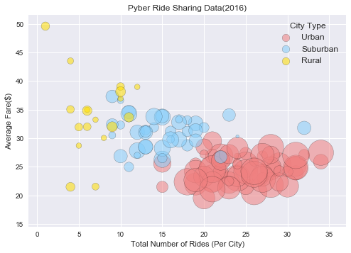
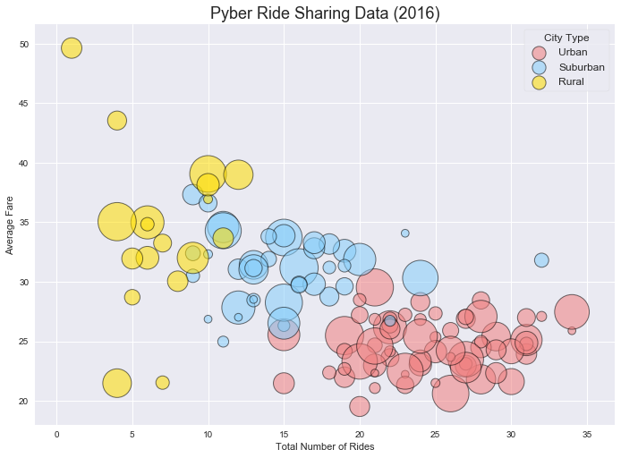
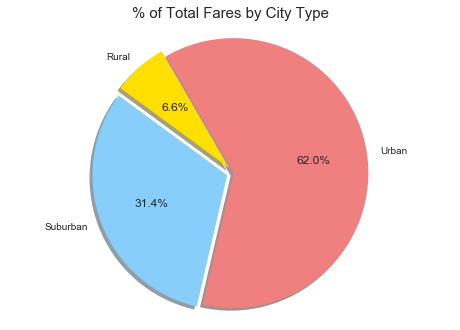
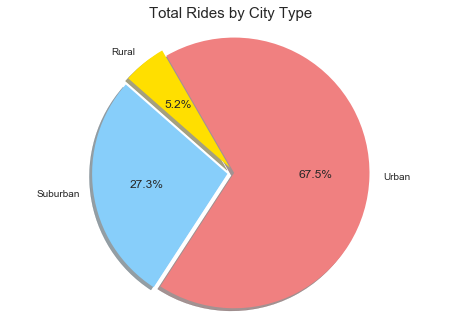
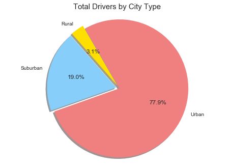

<h1>Pyber Analysis</h1>


<br><br><br><br><br><br><br><br><br><br><br><br><br><br><br>
<h3><i>Trends</i></h3>
***
<ul>
<li><b><u>Overall Revenue</b></u>.  Over two-thirds of Pyber's revenue is generated from Urban Cities.</li>  <br>
<li><b><u>Rides to Drivers Ratio</b></u>.   Some cities with high volumes of rides have a disporportionate number of drivers.<ul style="list-style-type:square"> <u>Recommendation</u>  Explore for further analysis.  <i>Is Pyber losing revenue because there are not enough drivers?  If there are too many drivers, and a low supply of rides relative to number of drivers..how is that affecting morale?  Are Pyber's employee compensation and rewards strategies properly aligned?</i></ul> </li><br>
<li><b><u>Relationship between average fares, revenue, and city type.</b></u>  Rural Areas have the average highest fares however generate the lowest revenue.  Similarly Urban Cities have the lowest average fares yet generate the  most revenue.</li>
</ul>


```python
#import dependencies
import pandas as pd
# Matplotlib for additional customization
from matplotlib import pyplot as plt
# Seaborn for plotting and styling
import seaborn as sns

#import data
city_data_raw = "city_data.csv"
city_data  = pd.read_csv(city_data_raw)
ride_data_raw = "ride_data.csv"
ride_data = pd.read_csv(ride_data_raw)
```

<h3>Average Fares, Total Rides, and Total Drivers by City</h3>


```python
#create dataframes groupedby fare mean and ridecount
avg_fare = ride_data.groupby(["city"])["fare"].mean()#.map("${:,.2f}".format)
# avg_fare2 = avg_fare.map("${:,.2f}".format)

avg_fare = pd.DataFrame(avg_fare).rename(columns={"fare": "Average Fare"}).reset_index()
count_rides = ride_data.groupby(["city"])["ride_id"].count()
count_rides = pd.DataFrame(count_rides).rename(columns={"ride_id": "Total Number of Rides"}).reset_index()
count_drivers = city_data.groupby(["city", "type"])["driver_count"].sum()
count_drivers = pd.DataFrame(count_drivers).rename(columns={"driver_count": "Total Number of Drivers"}).reset_index()

#merge dataframes
mt1 = pd.merge(count_rides, avg_fare,how="inner",on="city")
mt2 = pd.merge(mt1, count_drivers,how="inner",on=
                         "city").rename(columns={"city": "City","type": "City Type"})
#resort
mt3=mt2[["City", "Average Fare", "Total Number of Rides",  "Total Number of Drivers", "City Type"]]

mt3['Average Fare']=mt3['Average Fare'].map("${:,.2f}".format)

mt3.head()
```


<div>
<style>
    .dataframe thead tr:only-child th {
        text-align: right;
    }

    .dataframe thead th {
        text-align: left;
    }

    .dataframe tbody tr th {
        vertical-align: top;
    }
</style>
<table border="1" class="dataframe">
  <thead>
    <tr style="text-align: right;">
      <th></th>
      <th>City</th>
      <th>Average Fare</th>
      <th>Total Number of Rides</th>
      <th>Total Number of Drivers</th>
      <th>City Type</th>
    </tr>
  </thead>
  <tbody>
    <tr>
      <th>0</th>
      <td>Alvarezhaven</td>
      <td>$23.93</td>
      <td>31</td>
      <td>21</td>
      <td>Urban</td>
    </tr>
    <tr>
      <th>1</th>
      <td>Alyssaberg</td>
      <td>$20.61</td>
      <td>26</td>
      <td>67</td>
      <td>Urban</td>
    </tr>
    <tr>
      <th>2</th>
      <td>Anitamouth</td>
      <td>$37.32</td>
      <td>9</td>
      <td>16</td>
      <td>Suburban</td>
    </tr>
    <tr>
      <th>3</th>
      <td>Antoniomouth</td>
      <td>$23.62</td>
      <td>22</td>
      <td>21</td>
      <td>Urban</td>
    </tr>
    <tr>
      <th>4</th>
      <td>Aprilchester</td>
      <td>$21.98</td>
      <td>19</td>
      <td>49</td>
      <td>Urban</td>
    </tr>
  </tbody>
</table>
</div>


<h3>Bubble Plot of Ride Sharing Data</h3>


```python
value_list_u=['Urban']
value_list_s=['Suburban']
value_list_r=['Rural']
mt2_U=mt2[mt2['City Type'].isin(value_list_u)]
mt2_S=mt2[mt2['City Type'].isin(value_list_s)]
mt2_R=mt2[mt2['City Type'].isin(value_list_r)]

plt.title("Pyber Ride Sharing Data(2016)")
plt.xlabel("Total Number of Rides (Per City)")
plt.ylabel("Average Fare($)")


x_limit_max = mt2['Total Number of Rides'].max()
y_limit_max= mt2['Average Fare'].max()
x_limit_min = mt2['Total Number of Rides'].min()
y_limit_min= mt2['Average Fare'].min()

x_axis_U = mt2_U["Total Number of Rides"]
y_axis_U = mt2_U["Average Fare"]
x_axis_S = mt2_S["Total Number of Rides"]
y_axis_S = mt2_S["Average Fare"]
x_axis_R = mt2_R["Total Number of Rides"]
y_axis_R = mt2_R["Average Fare"]

a=plt.scatter(x_axis_U, y_axis_U, marker="o", facecolors="#f08080", edgecolors="black",
             s=mt2_U['Total Number of Drivers']*20, alpha=0.55 ,label="Urban")
b= plt.scatter(x_axis_S, y_axis_S, marker="o", facecolors="#87cefa", edgecolors="black",
             s=mt2_S['Total Number of Drivers']*20, alpha=0.55,label="Suburban")
c=plt.scatter(x_axis_R, y_axis_R, marker="o", facecolors="#FFDF00", edgecolors="black",
             s=mt2_R['Total Number of Drivers']*20, alpha=0.55,label="Rural")

plt.xlim(-1, x_limit_max+3)
plt.ylim(y_limit_min-5, y_limit_max+2)

lgnd=plt.legend(loc="upper right", title="City Type", fontsize=12)
for handle in lgnd.legendHandles:
    handle.set_sizes([110])

plt.show()
```





```python
#although less code is required for seaborn; scaling is not accurate across city types
#color palette list

#color list using Seaborn
clrlist = ["#f08080", "#87cefa", "#FFDF00"]
sns.set_palette(clrlist)

#create chart
sns.lmplot(x="Total Number of Rides", y="Average Fare", data= mt2, 
           hue="City Type",  size=7, aspect=1.4 ,
           legend_out = False, legend = True, 
           scatter_kws={"s":mt2["Total Number of Drivers"]*25, 
                        'alpha':.55,'edgecolors':"black", 'linewidth':1},ci=0, fit_reg=False, )
#add legend
plt.legend(loc="upper right", markerscale=.5, title="City Type", fontsize=12, frameon=True)
plt.title("Pyber Ride Sharing Data (2016)", fontsize=18)

plt.show()


```





<h3>Total Fares by City Type</h3>


```python
#create dataframe of summed totals
mt5 = pd.merge(city_data, ride_data,how="inner",on="city")
mt5_fare= mt5.groupby(["type"])["fare"].sum()

#create labels and set color theme for all pie charts
cities=["Rural","Suburban","Urban"]
colors = ["#FFDF00","#87cefa","#f08080"]

#create pie chart
explode = (0.05,.05,0)
plt.pie(mt5_fare, labels=cities, explode=explode,labeldistance=1.1,
        autopct="%1.1f%%", colors=colors, shadow=True, startangle=120)
plt.axis("equal")
plt.title("% of Total Fares by City Type", fontsize=15)


plt.show()

```





<h3>Total Rides by City Type</h3>


```python
#create dataframe of rides per city type
mt6 = pd.merge(city_data, ride_data,how="inner",on="city")
mt6_fare= mt6.groupby(["type"])["ride_id"].count()

#create pie chart
explode = (0.05,.05,0)
plt.pie(mt6_fare, labels=cities, explode=explode,labeldistance=1.1,
        autopct="%1.1f%%", colors=colors, shadow=True, startangle=120)
plt.axis("equal")
plt.title("Total Rides by City Type", fontsize=15)

plt.show()
```





<h3>Total Drivers by City Type</h3>


```python
#create dataframe of summed driver totals per city
mt7 = pd.merge(city_data, ride_data,how="inner",on="city")
#drop duplicate city rows to account for that each ride(row) already has a summed driver total
mt7=mt7.drop_duplicates(['city'])

mt7_fare= mt7.groupby(['type'])['driver_count'].sum()

#create pie chart
explode = (0.05,.05,0)
plt.pie(mt7_fare, labels=cities, explode=explode,labeldistance=1.1,
        autopct="%1.1f%%", colors=colors, shadow=True, startangle=120)
plt.axis("equal")
plt.title("Total Drivers by City Type", fontsize=15)

plt.show()

```





```python

```
