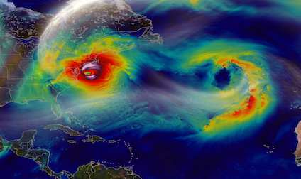
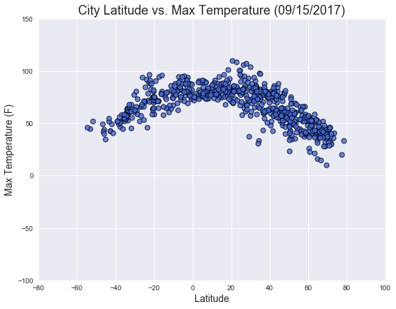
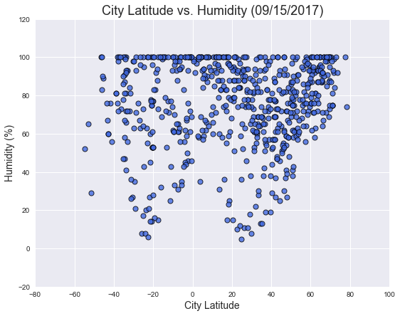
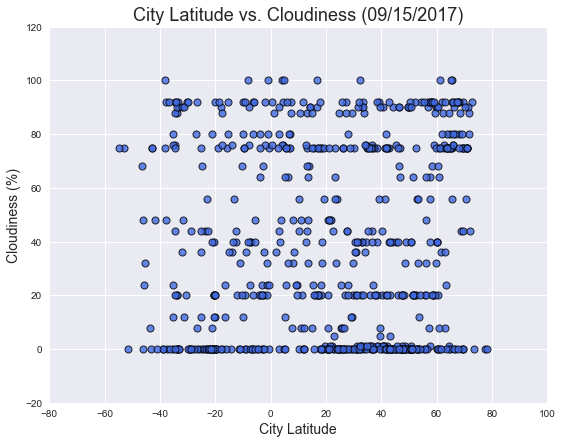
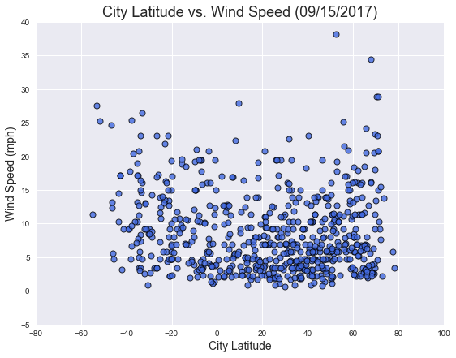

<h1>WeatherPy</h1>
<br><br><br><br><br><br><br><br><br><br><br><br><br><br>


```python
#dependencies
import json
import requests as req
import random 
from citipy import citipy
import pandas as pd
import time
import datetime
import csv
import os
import matplotlib.pyplot as plt
import seaborn as sns

#create lists to data
l1=[]
l2=[]
citipydata = []
cities=[]
cities2=[]
latitude=[]
longitude=[]
temperature=[]
humidity=[]
cloudiness=[]
windspeed=[]
date=[]
country=[]
maxtemp=[]
url_list=[]
recordcount=0
setcount=1

api_key = "********************************"
url = "http://api.openweathermap.org/data/2.5/weather?"
```

<h2>Generate Cities List</h2>


```python
#while loops to append lists; zip lists
while len(l1) < 2000:
    l1a = random.uniform(-90,90)
    l1.append(l1a)
while len(l2) < 2000:
    l2a = random.uniform(-180,180)
    l2.append(l2a)

coordinates = zip(l1,l2)


#Use citipy to find cities and store city names
for coordinate_pair in coordinates:
    lat, lon = coordinate_pair
    citipydata.append(citipy.nearest_city(lat, lon))
    cities.append(citipy.nearest_city(lat, lon).city_name)
    
#remove duplicates and limit list to 650
for city in cities:
    if city not in cities2:
        if len(cities2)< 650:    
            cities2.append(city)
            
            
```

<h2>Perform API Calls</h2>


```python
cities_c=[]
print("Beginning Data Retrieval")
print("-----------------------------------------")

#loop through cities and use API key to retrieve data
for city in cities2:
    print("Processing Record "+str(recordcount)+" of Set "+str(setcount)+" | "+city)
    print(url+"appid="+"*********************************"+"&q="+city+"&units=imperial")
#if error, print, and restart loop at next city  
    try:
        response = req.get(url+"appid="+api_key+"&q="+city+"&units=imperial").json()
        latitude.append(response["coord"]["lat"])
        longitude.append(response["coord"]["lon"])
        temperature.append(response["main"]["temp"])
        windspeed.append(response["wind"]["speed"])
        humidity.append(response["main"]["humidity"])
        cloudiness.append(response["clouds"]["all"])
        maxtemp.append(response["main"]["temp_max"])
        country.append(response["sys"]["country"])
        url_list.append(url+"appid="+api_key+"&q="+city+"&units=imperial")
        date.append(response["dt"])
        cities_c.append(city)
        
    except Exception as Error:
        print("Error with " + str(city) +" - Error Message: " + str(Error) )
        continue

#set batch sleep timer of 61 seconds for every 50 records 
    if recordcount < 50:
        recordcount=recordcount+1
    elif recordcount == 50:
        time.sleep(61)
        recordcount= 1
        setcount = setcount+1      
            
print("-----------------------------------------")
print("Data Retrieval Complete")
print("-----------------------------------------")
```

    Beginning Data Retrieval
    -----------------------------------------
    Processing Record 0 of Set 1 | esperance
    http://api.openweathermap.org/data/2.5/weather?appid=*********************************&q=esperance&units=imperial
    Processing Record 1 of Set 1 | bathsheba
    http://api.openweathermap.org/data/2.5/weather?appid=*********************************&q=bathsheba&units=imperial
    Processing Record 2 of Set 1 | tabou
    http://api.openweathermap.org/data/2.5/weather?appid=*********************************&q=tabou&units=imperial
    Processing Record 3 of Set 1 | tiksi
    http://api.openweathermap.org/data/2.5/weather?appid=*********************************&q=tiksi&units=imperial
    Processing Record 4 of Set 1 | kamenka
    http://api.openweathermap.org/data/2.5/weather?appid=*********************************&q=kamenka&units=imperial
    Processing Record 5 of Set 1 | victoria
    http://api.openweathermap.org/data/2.5/weather?appid=*********************************&q=victoria&units=imperial
    Processing Record 6 of Set 1 | hobart
    http://api.openweathermap.org/data/2.5/weather?appid=*********************************&q=hobart&units=imperial
    Processing Record 7 of Set 1 | vaini
    http://api.openweathermap.org/data/2.5/weather?appid=*********************************&q=vaini&units=imperial
    Processing Record 8 of Set 1 | cabo san lucas
    http://api.openweathermap.org/data/2.5/weather?appid=*********************************&q=cabo san lucas&units=imperial
    Processing Record 9 of Set 1 | tongling
    http://api.openweathermap.org/data/2.5/weather?appid=*********************************&q=tongling&units=imperial
    Processing Record 10 of Set 1 | busselton
    http://api.openweathermap.org/data/2.5/weather?appid=*********************************&q=busselton&units=imperial
    Processing Record 11 of Set 1 | syracuse
    http://api.openweathermap.org/data/2.5/weather?appid=*********************************&q=syracuse&units=imperial
    Processing Record 12 of Set 1 | tura
    http://api.openweathermap.org/data/2.5/weather?appid=*********************************&q=tura&units=imperial
    Processing Record 13 of Set 1 | yellowknife
    http://api.openweathermap.org/data/2.5/weather?appid=*********************************&q=yellowknife&units=imperial
    Processing Record 14 of Set 1 | jumla
    http://api.openweathermap.org/data/2.5/weather?appid=*********************************&q=jumla&units=imperial
    Processing Record 15 of Set 1 | cap-aux-meules
    http://api.openweathermap.org/data/2.5/weather?appid=*********************************&q=cap-aux-meules&units=imperial
    Processing Record 16 of Set 1 | lolua
    http://api.openweathermap.org/data/2.5/weather?appid=*********************************&q=lolua&units=imperial
    Processing Record 17 of Set 1 | kodiak
    http://api.openweathermap.org/data/2.5/weather?appid=*********************************&q=kodiak&units=imperial
    Processing Record 18 of Set 1 | rikitea
    http://api.openweathermap.org/data/2.5/weather?appid=*********************************&q=rikitea&units=imperial
    Processing Record 19 of Set 1 | shingu
    http://api.openweathermap.org/data/2.5/weather?appid=*********************************&q=shingu&units=imperial
    Processing Record 20 of Set 1 | pierre
    http://api.openweathermap.org/data/2.5/weather?appid=*********************************&q=pierre&units=imperial
    Processing Record 21 of Set 1 | castro
    http://api.openweathermap.org/data/2.5/weather?appid=*********************************&q=castro&units=imperial
    Processing Record 22 of Set 1 | hilo
    http://api.openweathermap.org/data/2.5/weather?appid=*********************************&q=hilo&units=imperial
    Processing Record 23 of Set 1 | kindu
    http://api.openweathermap.org/data/2.5/weather?appid=*********************************&q=kindu&units=imperial
    Processing Record 24 of Set 1 | qaanaaq
    http://api.openweathermap.org/data/2.5/weather?appid=*********************************&q=qaanaaq&units=imperial
    Processing Record 25 of Set 1 | homer
    http://api.openweathermap.org/data/2.5/weather?appid=*********************************&q=homer&units=imperial
    Processing Record 26 of Set 1 | mataura
    http://api.openweathermap.org/data/2.5/weather?appid=*********************************&q=mataura&units=imperial
    Processing Record 27 of Set 1 | portland
    http://api.openweathermap.org/data/2.5/weather?appid=*********************************&q=portland&units=imperial
    Processing Record 28 of Set 1 | mirnyy
    http://api.openweathermap.org/data/2.5/weather?appid=*********************************&q=mirnyy&units=imperial
    Processing Record 29 of Set 1 | kruisfontein
    http://api.openweathermap.org/data/2.5/weather?appid=*********************************&q=kruisfontein&units=imperial
    Processing Record 30 of Set 1 | sao joao da barra
    http://api.openweathermap.org/data/2.5/weather?appid=*********************************&q=sao joao da barra&units=imperial
    Processing Record 31 of Set 1 | punta arenas
    http://api.openweathermap.org/data/2.5/weather?appid=*********************************&q=punta arenas&units=imperial
    Processing Record 32 of Set 1 | new norfolk
    http://api.openweathermap.org/data/2.5/weather?appid=*********************************&q=new norfolk&units=imperial
    Processing Record 33 of Set 1 | fortuna
    http://api.openweathermap.org/data/2.5/weather?appid=*********************************&q=fortuna&units=imperial
    Processing Record 34 of Set 1 | cherskiy
    http://api.openweathermap.org/data/2.5/weather?appid=*********************************&q=cherskiy&units=imperial
    Processing Record 35 of Set 1 | chagda
    http://api.openweathermap.org/data/2.5/weather?appid=*********************************&q=chagda&units=imperial
    Processing Record 36 of Set 1 | cabedelo
    http://api.openweathermap.org/data/2.5/weather?appid=*********************************&q=cabedelo&units=imperial
    Processing Record 37 of Set 1 | vaitupu
    http://api.openweathermap.org/data/2.5/weather?appid=*********************************&q=vaitupu&units=imperial
    Processing Record 38 of Set 1 | nanortalik
    http://api.openweathermap.org/data/2.5/weather?appid=*********************************&q=nanortalik&units=imperial
    Processing Record 39 of Set 1 | bluff
    http://api.openweathermap.org/data/2.5/weather?appid=*********************************&q=bluff&units=imperial
    Processing Record 40 of Set 1 | tsabong
    http://api.openweathermap.org/data/2.5/weather?appid=*********************************&q=tsabong&units=imperial
    Processing Record 41 of Set 1 | yingcheng
    http://api.openweathermap.org/data/2.5/weather?appid=*********************************&q=yingcheng&units=imperial
    Processing Record 42 of Set 1 | tuy hoa
    http://api.openweathermap.org/data/2.5/weather?appid=*********************************&q=tuy hoa&units=imperial
    Processing Record 43 of Set 1 | albany
    http://api.openweathermap.org/data/2.5/weather?appid=*********************************&q=albany&units=imperial
    Processing Record 44 of Set 1 | nome
    http://api.openweathermap.org/data/2.5/weather?appid=*********************************&q=nome&units=imperial
    Processing Record 45 of Set 1 | kadykchan
    http://api.openweathermap.org/data/2.5/weather?appid=*********************************&q=kadykchan&units=imperial
    Processing Record 46 of Set 1 | upernavik
    http://api.openweathermap.org/data/2.5/weather?appid=*********************************&q=upernavik&units=imperial
    Processing Record 47 of Set 1 | souillac
    http://api.openweathermap.org/data/2.5/weather?appid=*********************************&q=souillac&units=imperial
    Processing Record 48 of Set 1 | panama city
    http://api.openweathermap.org/data/2.5/weather?appid=*********************************&q=panama city&units=imperial
    Processing Record 49 of Set 1 | belushya guba
    http://api.openweathermap.org/data/2.5/weather?appid=*********************************&q=belushya guba&units=imperial
    Processing Record 50 of Set 1 | mar del plata
    http://api.openweathermap.org/data/2.5/weather?appid=*********************************&q=mar del plata&units=imperial
    Processing Record 1 of Set 2 | cape town
    http://api.openweathermap.org/data/2.5/weather?appid=*********************************&q=cape town&units=imperial
    Processing Record 2 of Set 2 | goderich
    http://api.openweathermap.org/data/2.5/weather?appid=*********************************&q=goderich&units=imperial
    Processing Record 3 of Set 2 | kandrian
    http://api.openweathermap.org/data/2.5/weather?appid=*********************************&q=kandrian&units=imperial
    Processing Record 4 of Set 2 | gayny
    http://api.openweathermap.org/data/2.5/weather?appid=*********************************&q=gayny&units=imperial
    Processing Record 5 of Set 2 | anadyr
    http://api.openweathermap.org/data/2.5/weather?appid=*********************************&q=anadyr&units=imperial
    Processing Record 6 of Set 2 | ostrow wielkopolski
    http://api.openweathermap.org/data/2.5/weather?appid=*********************************&q=ostrow wielkopolski&units=imperial
    Processing Record 7 of Set 2 | havelock
    http://api.openweathermap.org/data/2.5/weather?appid=*********************************&q=havelock&units=imperial
    Processing Record 8 of Set 2 | teknaf
    http://api.openweathermap.org/data/2.5/weather?appid=*********************************&q=teknaf&units=imperial
    Processing Record 9 of Set 2 | varhaug
    http://api.openweathermap.org/data/2.5/weather?appid=*********************************&q=varhaug&units=imperial
    Processing Record 10 of Set 2 | magdagachi
    http://api.openweathermap.org/data/2.5/weather?appid=*********************************&q=magdagachi&units=imperial
    Processing Record 11 of Set 2 | port alfred
    http://api.openweathermap.org/data/2.5/weather?appid=*********************************&q=port alfred&units=imperial
    Processing Record 12 of Set 2 | ushuaia
    http://api.openweathermap.org/data/2.5/weather?appid=*********************************&q=ushuaia&units=imperial
    Processing Record 13 of Set 2 | komsomolskiy
    http://api.openweathermap.org/data/2.5/weather?appid=*********************************&q=komsomolskiy&units=imperial
    Processing Record 14 of Set 2 | puerto ayora
    http://api.openweathermap.org/data/2.5/weather?appid=*********************************&q=puerto ayora&units=imperial
    Processing Record 15 of Set 2 | kosugi
    http://api.openweathermap.org/data/2.5/weather?appid=*********************************&q=kosugi&units=imperial
    Processing Record 16 of Set 2 | san julian
    http://api.openweathermap.org/data/2.5/weather?appid=*********************************&q=san julian&units=imperial
    Processing Record 17 of Set 2 | thompson
    http://api.openweathermap.org/data/2.5/weather?appid=*********************************&q=thompson&units=imperial
    Processing Record 18 of Set 2 | sydney mines
    http://api.openweathermap.org/data/2.5/weather?appid=*********************************&q=sydney mines&units=imperial
    Processing Record 19 of Set 2 | taolanaro
    http://api.openweathermap.org/data/2.5/weather?appid=*********************************&q=taolanaro&units=imperial
    Processing Record 20 of Set 2 | puerto escondido
    http://api.openweathermap.org/data/2.5/weather?appid=*********************************&q=puerto escondido&units=imperial
    Processing Record 21 of Set 2 | boljarovo
    http://api.openweathermap.org/data/2.5/weather?appid=*********************************&q=boljarovo&units=imperial
    Processing Record 22 of Set 2 | east london
    http://api.openweathermap.org/data/2.5/weather?appid=*********************************&q=east london&units=imperial
    Processing Record 23 of Set 2 | umzimvubu
    http://api.openweathermap.org/data/2.5/weather?appid=*********************************&q=umzimvubu&units=imperial
    Processing Record 24 of Set 2 | tilichiki
    http://api.openweathermap.org/data/2.5/weather?appid=*********************************&q=tilichiki&units=imperial
    Processing Record 25 of Set 2 | okha
    http://api.openweathermap.org/data/2.5/weather?appid=*********************************&q=okha&units=imperial
    Processing Record 26 of Set 2 | arraial do cabo
    http://api.openweathermap.org/data/2.5/weather?appid=*********************************&q=arraial do cabo&units=imperial
    Processing Record 27 of Set 2 | dzhusaly
    http://api.openweathermap.org/data/2.5/weather?appid=*********************************&q=dzhusaly&units=imperial
    Processing Record 28 of Set 2 | sitka
    http://api.openweathermap.org/data/2.5/weather?appid=*********************************&q=sitka&units=imperial
    Processing Record 29 of Set 2 | illoqqortoormiut
    http://api.openweathermap.org/data/2.5/weather?appid=*********************************&q=illoqqortoormiut&units=imperial
    Processing Record 30 of Set 2 | paragominas
    http://api.openweathermap.org/data/2.5/weather?appid=*********************************&q=paragominas&units=imperial
    Processing Record 31 of Set 2 | luderitz
    http://api.openweathermap.org/data/2.5/weather?appid=*********************************&q=luderitz&units=imperial
    Processing Record 32 of Set 2 | ancud
    http://api.openweathermap.org/data/2.5/weather?appid=*********************************&q=ancud&units=imperial
    Processing Record 33 of Set 2 | saskylakh
    http://api.openweathermap.org/data/2.5/weather?appid=*********************************&q=saskylakh&units=imperial
    Processing Record 34 of Set 2 | torbay
    http://api.openweathermap.org/data/2.5/weather?appid=*********************************&q=torbay&units=imperial
    Processing Record 35 of Set 2 | matagami
    http://api.openweathermap.org/data/2.5/weather?appid=*********************************&q=matagami&units=imperial
    Processing Record 36 of Set 2 | sakakah
    http://api.openweathermap.org/data/2.5/weather?appid=*********************************&q=sakakah&units=imperial
    Processing Record 37 of Set 2 | luwuk
    http://api.openweathermap.org/data/2.5/weather?appid=*********************************&q=luwuk&units=imperial
    Processing Record 38 of Set 2 | kuytun
    http://api.openweathermap.org/data/2.5/weather?appid=*********************************&q=kuytun&units=imperial
    Processing Record 39 of Set 2 | pesaro
    http://api.openweathermap.org/data/2.5/weather?appid=*********************************&q=pesaro&units=imperial
    Processing Record 40 of Set 2 | krasnoselkup
    http://api.openweathermap.org/data/2.5/weather?appid=*********************************&q=krasnoselkup&units=imperial
    Processing Record 41 of Set 2 | bredasdorp
    http://api.openweathermap.org/data/2.5/weather?appid=*********************************&q=bredasdorp&units=imperial
    Processing Record 42 of Set 2 | santa cruz
    http://api.openweathermap.org/data/2.5/weather?appid=*********************************&q=santa cruz&units=imperial
    Processing Record 43 of Set 2 | georgetown
    http://api.openweathermap.org/data/2.5/weather?appid=*********************************&q=georgetown&units=imperial
    Processing Record 44 of Set 2 | fort nelson
    http://api.openweathermap.org/data/2.5/weather?appid=*********************************&q=fort nelson&units=imperial
    Processing Record 45 of Set 2 | kapaa
    http://api.openweathermap.org/data/2.5/weather?appid=*********************************&q=kapaa&units=imperial
    Processing Record 46 of Set 2 | alvand
    http://api.openweathermap.org/data/2.5/weather?appid=*********************************&q=alvand&units=imperial
    Processing Record 47 of Set 2 | barawe
    http://api.openweathermap.org/data/2.5/weather?appid=*********************************&q=barawe&units=imperial
    Processing Record 48 of Set 2 | marcona
    http://api.openweathermap.org/data/2.5/weather?appid=*********************************&q=marcona&units=imperial
    Processing Record 49 of Set 2 | hofn
    http://api.openweathermap.org/data/2.5/weather?appid=*********************************&q=hofn&units=imperial
    Processing Record 50 of Set 2 | luganville
    http://api.openweathermap.org/data/2.5/weather?appid=*********************************&q=luganville&units=imperial
    Processing Record 1 of Set 3 | bethel
    http://api.openweathermap.org/data/2.5/weather?appid=*********************************&q=bethel&units=imperial
    Processing Record 2 of Set 3 | presidencia roque saenz pena
    http://api.openweathermap.org/data/2.5/weather?appid=*********************************&q=presidencia roque saenz pena&units=imperial
    Processing Record 3 of Set 3 | mount gambier
    http://api.openweathermap.org/data/2.5/weather?appid=*********************************&q=mount gambier&units=imperial
    Processing Record 4 of Set 3 | jalu
    http://api.openweathermap.org/data/2.5/weather?appid=*********************************&q=jalu&units=imperial
    Processing Record 5 of Set 3 | hermanus
    http://api.openweathermap.org/data/2.5/weather?appid=*********************************&q=hermanus&units=imperial
    Processing Record 6 of Set 3 | vitim
    http://api.openweathermap.org/data/2.5/weather?appid=*********************************&q=vitim&units=imperial
    Processing Record 7 of Set 3 | cockburn town
    http://api.openweathermap.org/data/2.5/weather?appid=*********************************&q=cockburn town&units=imperial
    Processing Record 8 of Set 3 | itoman
    http://api.openweathermap.org/data/2.5/weather?appid=*********************************&q=itoman&units=imperial
    Processing Record 9 of Set 3 | klaksvik
    http://api.openweathermap.org/data/2.5/weather?appid=*********************************&q=klaksvik&units=imperial
    Processing Record 10 of Set 3 | malilipot
    http://api.openweathermap.org/data/2.5/weather?appid=*********************************&q=malilipot&units=imperial
    Processing Record 11 of Set 3 | lehututu
    http://api.openweathermap.org/data/2.5/weather?appid=*********************************&q=lehututu&units=imperial
    Processing Record 12 of Set 3 | petropavlovka
    http://api.openweathermap.org/data/2.5/weather?appid=*********************************&q=petropavlovka&units=imperial
    Processing Record 13 of Set 3 | sambava
    http://api.openweathermap.org/data/2.5/weather?appid=*********************************&q=sambava&units=imperial
    Processing Record 14 of Set 3 | brae
    http://api.openweathermap.org/data/2.5/weather?appid=*********************************&q=brae&units=imperial
    Processing Record 15 of Set 3 | tuatapere
    http://api.openweathermap.org/data/2.5/weather?appid=*********************************&q=tuatapere&units=imperial
    Processing Record 16 of Set 3 | paamiut
    http://api.openweathermap.org/data/2.5/weather?appid=*********************************&q=paamiut&units=imperial
    Processing Record 17 of Set 3 | talnakh
    http://api.openweathermap.org/data/2.5/weather?appid=*********************************&q=talnakh&units=imperial
    Processing Record 18 of Set 3 | kidal
    http://api.openweathermap.org/data/2.5/weather?appid=*********************************&q=kidal&units=imperial
    Processing Record 19 of Set 3 | port townsend
    http://api.openweathermap.org/data/2.5/weather?appid=*********************************&q=port townsend&units=imperial
    Processing Record 20 of Set 3 | ushumun
    http://api.openweathermap.org/data/2.5/weather?appid=*********************************&q=ushumun&units=imperial
    Processing Record 21 of Set 3 | taoudenni
    http://api.openweathermap.org/data/2.5/weather?appid=*********************************&q=taoudenni&units=imperial
    Processing Record 22 of Set 3 | codrington
    http://api.openweathermap.org/data/2.5/weather?appid=*********************************&q=codrington&units=imperial
    Processing Record 23 of Set 3 | hanyang
    http://api.openweathermap.org/data/2.5/weather?appid=*********************************&q=hanyang&units=imperial
    Processing Record 24 of Set 3 | ponta do sol
    http://api.openweathermap.org/data/2.5/weather?appid=*********************************&q=ponta do sol&units=imperial
    Processing Record 25 of Set 3 | steamboat springs
    http://api.openweathermap.org/data/2.5/weather?appid=*********************************&q=steamboat springs&units=imperial
    Processing Record 26 of Set 3 | kavaratti
    http://api.openweathermap.org/data/2.5/weather?appid=*********************************&q=kavaratti&units=imperial
    Processing Record 27 of Set 3 | lebu
    http://api.openweathermap.org/data/2.5/weather?appid=*********************************&q=lebu&units=imperial
    Processing Record 28 of Set 3 | nanakuli
    http://api.openweathermap.org/data/2.5/weather?appid=*********************************&q=nanakuli&units=imperial
    Processing Record 29 of Set 3 | mugur-aksy
    http://api.openweathermap.org/data/2.5/weather?appid=*********************************&q=mugur-aksy&units=imperial
    Processing Record 30 of Set 3 | dzilam gonzalez
    http://api.openweathermap.org/data/2.5/weather?appid=*********************************&q=dzilam gonzalez&units=imperial
    Processing Record 31 of Set 3 | bandarbeyla
    http://api.openweathermap.org/data/2.5/weather?appid=*********************************&q=bandarbeyla&units=imperial
    Processing Record 32 of Set 3 | toliary
    http://api.openweathermap.org/data/2.5/weather?appid=*********************************&q=toliary&units=imperial
    Processing Record 33 of Set 3 | port lincoln
    http://api.openweathermap.org/data/2.5/weather?appid=*********************************&q=port lincoln&units=imperial
    Processing Record 34 of Set 3 | kaitangata
    http://api.openweathermap.org/data/2.5/weather?appid=*********************************&q=kaitangata&units=imperial
    Processing Record 35 of Set 3 | mazatlan
    http://api.openweathermap.org/data/2.5/weather?appid=*********************************&q=mazatlan&units=imperial
    Processing Record 36 of Set 3 | cidreira
    http://api.openweathermap.org/data/2.5/weather?appid=*********************************&q=cidreira&units=imperial
    Processing Record 37 of Set 3 | narsaq
    http://api.openweathermap.org/data/2.5/weather?appid=*********************************&q=narsaq&units=imperial
    Processing Record 38 of Set 3 | barrow
    http://api.openweathermap.org/data/2.5/weather?appid=*********************************&q=barrow&units=imperial
    Processing Record 39 of Set 3 | saint-philippe
    http://api.openweathermap.org/data/2.5/weather?appid=*********************************&q=saint-philippe&units=imperial
    Processing Record 40 of Set 3 | ilulissat
    http://api.openweathermap.org/data/2.5/weather?appid=*********************************&q=ilulissat&units=imperial
    Processing Record 41 of Set 3 | samusu
    http://api.openweathermap.org/data/2.5/weather?appid=*********************************&q=samusu&units=imperial
    Processing Record 42 of Set 3 | vila velha
    http://api.openweathermap.org/data/2.5/weather?appid=*********************************&q=vila velha&units=imperial
    Processing Record 43 of Set 3 | terekli-mekteb
    http://api.openweathermap.org/data/2.5/weather?appid=*********************************&q=terekli-mekteb&units=imperial
    Processing Record 44 of Set 3 | ribeira grande
    http://api.openweathermap.org/data/2.5/weather?appid=*********************************&q=ribeira grande&units=imperial
    Processing Record 45 of Set 3 | kahului
    http://api.openweathermap.org/data/2.5/weather?appid=*********************************&q=kahului&units=imperial
    Processing Record 46 of Set 3 | atuona
    http://api.openweathermap.org/data/2.5/weather?appid=*********************************&q=atuona&units=imperial
    Processing Record 47 of Set 3 | khasan
    http://api.openweathermap.org/data/2.5/weather?appid=*********************************&q=khasan&units=imperial
    Processing Record 48 of Set 3 | nizhneyansk
    http://api.openweathermap.org/data/2.5/weather?appid=*********************************&q=nizhneyansk&units=imperial
    Processing Record 49 of Set 3 | balikpapan
    http://api.openweathermap.org/data/2.5/weather?appid=*********************************&q=balikpapan&units=imperial
    Processing Record 50 of Set 3 | margate
    http://api.openweathermap.org/data/2.5/weather?appid=*********************************&q=margate&units=imperial
    Processing Record 1 of Set 4 | gorontalo
    http://api.openweathermap.org/data/2.5/weather?appid=*********************************&q=gorontalo&units=imperial
    Processing Record 2 of Set 4 | iqaluit
    http://api.openweathermap.org/data/2.5/weather?appid=*********************************&q=iqaluit&units=imperial
    Processing Record 3 of Set 4 | karratha
    http://api.openweathermap.org/data/2.5/weather?appid=*********************************&q=karratha&units=imperial
    Processing Record 4 of Set 4 | los chiles
    http://api.openweathermap.org/data/2.5/weather?appid=*********************************&q=los chiles&units=imperial
    Processing Record 5 of Set 4 | urucara
    http://api.openweathermap.org/data/2.5/weather?appid=*********************************&q=urucara&units=imperial
    Processing Record 6 of Set 4 | conde
    http://api.openweathermap.org/data/2.5/weather?appid=*********************************&q=conde&units=imperial
    Processing Record 7 of Set 4 | half moon bay
    http://api.openweathermap.org/data/2.5/weather?appid=*********************************&q=half moon bay&units=imperial
    Processing Record 8 of Set 4 | atka
    http://api.openweathermap.org/data/2.5/weather?appid=*********************************&q=atka&units=imperial
    Processing Record 9 of Set 4 | honningsvag
    http://api.openweathermap.org/data/2.5/weather?appid=*********************************&q=honningsvag&units=imperial
    Processing Record 10 of Set 4 | namatanai
    http://api.openweathermap.org/data/2.5/weather?appid=*********************************&q=namatanai&units=imperial
    Processing Record 11 of Set 4 | gobabis
    http://api.openweathermap.org/data/2.5/weather?appid=*********************************&q=gobabis&units=imperial
    Processing Record 12 of Set 4 | yoichi
    http://api.openweathermap.org/data/2.5/weather?appid=*********************************&q=yoichi&units=imperial
    Processing Record 13 of Set 4 | manga
    http://api.openweathermap.org/data/2.5/weather?appid=*********************************&q=manga&units=imperial
    Processing Record 14 of Set 4 | constitucion
    http://api.openweathermap.org/data/2.5/weather?appid=*********************************&q=constitucion&units=imperial
    Processing Record 15 of Set 4 | ayna
    http://api.openweathermap.org/data/2.5/weather?appid=*********************************&q=ayna&units=imperial
    Processing Record 16 of Set 4 | copperas cove
    http://api.openweathermap.org/data/2.5/weather?appid=*********************************&q=copperas cove&units=imperial
    Processing Record 17 of Set 4 | avera
    http://api.openweathermap.org/data/2.5/weather?appid=*********************************&q=avera&units=imperial
    Processing Record 18 of Set 4 | belmonte
    http://api.openweathermap.org/data/2.5/weather?appid=*********************************&q=belmonte&units=imperial
    Processing Record 19 of Set 4 | hami
    http://api.openweathermap.org/data/2.5/weather?appid=*********************************&q=hami&units=imperial
    Processing Record 20 of Set 4 | avarua
    http://api.openweathermap.org/data/2.5/weather?appid=*********************************&q=avarua&units=imperial
    Processing Record 21 of Set 4 | deputatskiy
    http://api.openweathermap.org/data/2.5/weather?appid=*********************************&q=deputatskiy&units=imperial
    Processing Record 22 of Set 4 | victoria point
    http://api.openweathermap.org/data/2.5/weather?appid=*********************************&q=victoria point&units=imperial
    Processing Record 23 of Set 4 | paradwip
    http://api.openweathermap.org/data/2.5/weather?appid=*********************************&q=paradwip&units=imperial
    Processing Record 24 of Set 4 | taywarah
    http://api.openweathermap.org/data/2.5/weather?appid=*********************************&q=taywarah&units=imperial
    Processing Record 25 of Set 4 | huarmey
    http://api.openweathermap.org/data/2.5/weather?appid=*********************************&q=huarmey&units=imperial
    Processing Record 26 of Set 4 | mogadishu
    http://api.openweathermap.org/data/2.5/weather?appid=*********************************&q=mogadishu&units=imperial
    Processing Record 27 of Set 4 | tevriz
    http://api.openweathermap.org/data/2.5/weather?appid=*********************************&q=tevriz&units=imperial
    Processing Record 28 of Set 4 | saint george
    http://api.openweathermap.org/data/2.5/weather?appid=*********************************&q=saint george&units=imperial
    Processing Record 29 of Set 4 | neuquen
    http://api.openweathermap.org/data/2.5/weather?appid=*********************************&q=neuquen&units=imperial
    Processing Record 30 of Set 4 | sentyabrskiy
    http://api.openweathermap.org/data/2.5/weather?appid=*********************************&q=sentyabrskiy&units=imperial
    Processing Record 31 of Set 4 | bosaso
    http://api.openweathermap.org/data/2.5/weather?appid=*********************************&q=bosaso&units=imperial
    Processing Record 32 of Set 4 | ust-nera
    http://api.openweathermap.org/data/2.5/weather?appid=*********************************&q=ust-nera&units=imperial
    Processing Record 33 of Set 4 | itatskiy
    http://api.openweathermap.org/data/2.5/weather?appid=*********************************&q=itatskiy&units=imperial
    Processing Record 34 of Set 4 | yueyang
    http://api.openweathermap.org/data/2.5/weather?appid=*********************************&q=yueyang&units=imperial
    Processing Record 35 of Set 4 | barentsburg
    http://api.openweathermap.org/data/2.5/weather?appid=*********************************&q=barentsburg&units=imperial
    Processing Record 36 of Set 4 | the valley
    http://api.openweathermap.org/data/2.5/weather?appid=*********************************&q=the valley&units=imperial
    Processing Record 37 of Set 4 | anguillara sabazia
    http://api.openweathermap.org/data/2.5/weather?appid=*********************************&q=anguillara sabazia&units=imperial
    Processing Record 38 of Set 4 | hede
    http://api.openweathermap.org/data/2.5/weather?appid=*********************************&q=hede&units=imperial
    Processing Record 39 of Set 4 | lagoa
    http://api.openweathermap.org/data/2.5/weather?appid=*********************************&q=lagoa&units=imperial
    Processing Record 40 of Set 4 | yirol
    http://api.openweathermap.org/data/2.5/weather?appid=*********************************&q=yirol&units=imperial
    Processing Record 41 of Set 4 | butaritari
    http://api.openweathermap.org/data/2.5/weather?appid=*********************************&q=butaritari&units=imperial
    Processing Record 42 of Set 4 | longyearbyen
    http://api.openweathermap.org/data/2.5/weather?appid=*********************************&q=longyearbyen&units=imperial
    Processing Record 43 of Set 4 | lyuban
    http://api.openweathermap.org/data/2.5/weather?appid=*********************************&q=lyuban&units=imperial
    Processing Record 44 of Set 4 | alice springs
    http://api.openweathermap.org/data/2.5/weather?appid=*********************************&q=alice springs&units=imperial
    Processing Record 45 of Set 4 | shakhtinsk
    http://api.openweathermap.org/data/2.5/weather?appid=*********************************&q=shakhtinsk&units=imperial
    Processing Record 46 of Set 4 | korla
    http://api.openweathermap.org/data/2.5/weather?appid=*********************************&q=korla&units=imperial
    Processing Record 47 of Set 4 | kiunga
    http://api.openweathermap.org/data/2.5/weather?appid=*********************************&q=kiunga&units=imperial
    Processing Record 48 of Set 4 | petropavlovsk-kamchatskiy
    http://api.openweathermap.org/data/2.5/weather?appid=*********************************&q=petropavlovsk-kamchatskiy&units=imperial
    Processing Record 49 of Set 4 | pevek
    http://api.openweathermap.org/data/2.5/weather?appid=*********************************&q=pevek&units=imperial
    Processing Record 50 of Set 4 | lata
    http://api.openweathermap.org/data/2.5/weather?appid=*********************************&q=lata&units=imperial
    Processing Record 1 of Set 5 | santa rosa
    http://api.openweathermap.org/data/2.5/weather?appid=*********************************&q=santa rosa&units=imperial
    Processing Record 2 of Set 5 | csorvas
    http://api.openweathermap.org/data/2.5/weather?appid=*********************************&q=csorvas&units=imperial
    Processing Record 3 of Set 5 | bowen
    http://api.openweathermap.org/data/2.5/weather?appid=*********************************&q=bowen&units=imperial
    Processing Record 4 of Set 5 | mayaky
    http://api.openweathermap.org/data/2.5/weather?appid=*********************************&q=mayaky&units=imperial
    Processing Record 5 of Set 5 | thomasville
    http://api.openweathermap.org/data/2.5/weather?appid=*********************************&q=thomasville&units=imperial
    Processing Record 6 of Set 5 | attawapiskat
    http://api.openweathermap.org/data/2.5/weather?appid=*********************************&q=attawapiskat&units=imperial
    Processing Record 7 of Set 5 | isagarh
    http://api.openweathermap.org/data/2.5/weather?appid=*********************************&q=isagarh&units=imperial
    Processing Record 8 of Set 5 | andradas
    http://api.openweathermap.org/data/2.5/weather?appid=*********************************&q=andradas&units=imperial
    Processing Record 9 of Set 5 | swan hill
    http://api.openweathermap.org/data/2.5/weather?appid=*********************************&q=swan hill&units=imperial
    Processing Record 10 of Set 5 | bani
    http://api.openweathermap.org/data/2.5/weather?appid=*********************************&q=bani&units=imperial
    Processing Record 11 of Set 5 | tasiilaq
    http://api.openweathermap.org/data/2.5/weather?appid=*********************************&q=tasiilaq&units=imperial
    Processing Record 12 of Set 5 | tabiauea
    http://api.openweathermap.org/data/2.5/weather?appid=*********************************&q=tabiauea&units=imperial
    Processing Record 13 of Set 5 | belaya gora
    http://api.openweathermap.org/data/2.5/weather?appid=*********************************&q=belaya gora&units=imperial
    Processing Record 14 of Set 5 | henderson
    http://api.openweathermap.org/data/2.5/weather?appid=*********************************&q=henderson&units=imperial
    Processing Record 15 of Set 5 | lompoc
    http://api.openweathermap.org/data/2.5/weather?appid=*********************************&q=lompoc&units=imperial
    Processing Record 16 of Set 5 | rapar
    http://api.openweathermap.org/data/2.5/weather?appid=*********************************&q=rapar&units=imperial
    Processing Record 17 of Set 5 | perbaungan
    http://api.openweathermap.org/data/2.5/weather?appid=*********************************&q=perbaungan&units=imperial
    Processing Record 18 of Set 5 | bardiyah
    http://api.openweathermap.org/data/2.5/weather?appid=*********************************&q=bardiyah&units=imperial
    Processing Record 19 of Set 5 | ostrovnoy
    http://api.openweathermap.org/data/2.5/weather?appid=*********************************&q=ostrovnoy&units=imperial
    Processing Record 20 of Set 5 | etla
    http://api.openweathermap.org/data/2.5/weather?appid=*********************************&q=etla&units=imperial
    Processing Record 21 of Set 5 | buraydah
    http://api.openweathermap.org/data/2.5/weather?appid=*********************************&q=buraydah&units=imperial
    Processing Record 22 of Set 5 | ust-ilimsk
    http://api.openweathermap.org/data/2.5/weather?appid=*********************************&q=ust-ilimsk&units=imperial
    Processing Record 23 of Set 5 | dikson
    http://api.openweathermap.org/data/2.5/weather?appid=*********************************&q=dikson&units=imperial
    Processing Record 24 of Set 5 | severo-kurilsk
    http://api.openweathermap.org/data/2.5/weather?appid=*********************************&q=severo-kurilsk&units=imperial
    Processing Record 25 of Set 5 | sena madureira
    http://api.openweathermap.org/data/2.5/weather?appid=*********************************&q=sena madureira&units=imperial
    Processing Record 26 of Set 5 | port elizabeth
    http://api.openweathermap.org/data/2.5/weather?appid=*********************************&q=port elizabeth&units=imperial
    Processing Record 27 of Set 5 | mount pleasant
    http://api.openweathermap.org/data/2.5/weather?appid=*********************************&q=mount pleasant&units=imperial
    Processing Record 28 of Set 5 | karwar
    http://api.openweathermap.org/data/2.5/weather?appid=*********************************&q=karwar&units=imperial
    Processing Record 29 of Set 5 | miles city
    http://api.openweathermap.org/data/2.5/weather?appid=*********************************&q=miles city&units=imperial
    Processing Record 30 of Set 5 | tautira
    http://api.openweathermap.org/data/2.5/weather?appid=*********************************&q=tautira&units=imperial
    Processing Record 31 of Set 5 | clyde river
    http://api.openweathermap.org/data/2.5/weather?appid=*********************************&q=clyde river&units=imperial
    Processing Record 32 of Set 5 | tawkar
    http://api.openweathermap.org/data/2.5/weather?appid=*********************************&q=tawkar&units=imperial
    Processing Record 33 of Set 5 | faya
    http://api.openweathermap.org/data/2.5/weather?appid=*********************************&q=faya&units=imperial
    Processing Record 34 of Set 5 | roebourne
    http://api.openweathermap.org/data/2.5/weather?appid=*********************************&q=roebourne&units=imperial
    Processing Record 35 of Set 5 | naryan-mar
    http://api.openweathermap.org/data/2.5/weather?appid=*********************************&q=naryan-mar&units=imperial
    Processing Record 36 of Set 5 | talara
    http://api.openweathermap.org/data/2.5/weather?appid=*********************************&q=talara&units=imperial
    Processing Record 37 of Set 5 | umm lajj
    http://api.openweathermap.org/data/2.5/weather?appid=*********************************&q=umm lajj&units=imperial
    Processing Record 38 of Set 5 | jamestown
    http://api.openweathermap.org/data/2.5/weather?appid=*********************************&q=jamestown&units=imperial
    Processing Record 39 of Set 5 | novyy urengoy
    http://api.openweathermap.org/data/2.5/weather?appid=*********************************&q=novyy urengoy&units=imperial
    Processing Record 40 of Set 5 | buin
    http://api.openweathermap.org/data/2.5/weather?appid=*********************************&q=buin&units=imperial
    Processing Record 41 of Set 5 | adrar
    http://api.openweathermap.org/data/2.5/weather?appid=*********************************&q=adrar&units=imperial
    Processing Record 42 of Set 5 | manono
    http://api.openweathermap.org/data/2.5/weather?appid=*********************************&q=manono&units=imperial
    Processing Record 43 of Set 5 | yumen
    http://api.openweathermap.org/data/2.5/weather?appid=*********************************&q=yumen&units=imperial
    Processing Record 44 of Set 5 | calvinia
    http://api.openweathermap.org/data/2.5/weather?appid=*********************************&q=calvinia&units=imperial
    Processing Record 45 of Set 5 | washington
    http://api.openweathermap.org/data/2.5/weather?appid=*********************************&q=washington&units=imperial
    Processing Record 46 of Set 5 | richards bay
    http://api.openweathermap.org/data/2.5/weather?appid=*********************************&q=richards bay&units=imperial
    Processing Record 47 of Set 5 | sawakin
    http://api.openweathermap.org/data/2.5/weather?appid=*********************************&q=sawakin&units=imperial
    Processing Record 48 of Set 5 | barahona
    http://api.openweathermap.org/data/2.5/weather?appid=*********************************&q=barahona&units=imperial
    Processing Record 49 of Set 5 | frisco
    http://api.openweathermap.org/data/2.5/weather?appid=*********************************&q=frisco&units=imperial
    Processing Record 50 of Set 5 | kisaran
    http://api.openweathermap.org/data/2.5/weather?appid=*********************************&q=kisaran&units=imperial
    Processing Record 1 of Set 6 | mokhotlong
    http://api.openweathermap.org/data/2.5/weather?appid=*********************************&q=mokhotlong&units=imperial
    Processing Record 2 of Set 6 | forestville
    http://api.openweathermap.org/data/2.5/weather?appid=*********************************&q=forestville&units=imperial
    Processing Record 3 of Set 6 | aquiraz
    http://api.openweathermap.org/data/2.5/weather?appid=*********************************&q=aquiraz&units=imperial
    Processing Record 4 of Set 6 | katsuura
    http://api.openweathermap.org/data/2.5/weather?appid=*********************************&q=katsuura&units=imperial
    Processing Record 5 of Set 6 | ust-kamchatsk
    http://api.openweathermap.org/data/2.5/weather?appid=*********************************&q=ust-kamchatsk&units=imperial
    Processing Record 6 of Set 6 | airai
    http://api.openweathermap.org/data/2.5/weather?appid=*********************************&q=airai&units=imperial
    Processing Record 7 of Set 6 | laguna
    http://api.openweathermap.org/data/2.5/weather?appid=*********************************&q=laguna&units=imperial
    Processing Record 8 of Set 6 | bonfim
    http://api.openweathermap.org/data/2.5/weather?appid=*********************************&q=bonfim&units=imperial
    Processing Record 9 of Set 6 | bayir
    http://api.openweathermap.org/data/2.5/weather?appid=*********************************&q=bayir&units=imperial
    Processing Record 10 of Set 6 | dhidhdhoo
    http://api.openweathermap.org/data/2.5/weather?appid=*********************************&q=dhidhdhoo&units=imperial
    Processing Record 11 of Set 6 | christchurch
    http://api.openweathermap.org/data/2.5/weather?appid=*********************************&q=christchurch&units=imperial
    Processing Record 12 of Set 6 | cartagena del chaira
    http://api.openweathermap.org/data/2.5/weather?appid=*********************************&q=cartagena del chaira&units=imperial
    Processing Record 13 of Set 6 | padang
    http://api.openweathermap.org/data/2.5/weather?appid=*********************************&q=padang&units=imperial
    Processing Record 14 of Set 6 | najran
    http://api.openweathermap.org/data/2.5/weather?appid=*********************************&q=najran&units=imperial
    Processing Record 15 of Set 6 | veraval
    http://api.openweathermap.org/data/2.5/weather?appid=*********************************&q=veraval&units=imperial
    Processing Record 16 of Set 6 | akyab
    http://api.openweathermap.org/data/2.5/weather?appid=*********************************&q=akyab&units=imperial
    Processing Record 17 of Set 6 | nikolskoye
    http://api.openweathermap.org/data/2.5/weather?appid=*********************************&q=nikolskoye&units=imperial
    Processing Record 18 of Set 6 | mahebourg
    http://api.openweathermap.org/data/2.5/weather?appid=*********************************&q=mahebourg&units=imperial
    Processing Record 19 of Set 6 | itaituba
    http://api.openweathermap.org/data/2.5/weather?appid=*********************************&q=itaituba&units=imperial
    Processing Record 20 of Set 6 | nemuro
    http://api.openweathermap.org/data/2.5/weather?appid=*********************************&q=nemuro&units=imperial
    Processing Record 21 of Set 6 | acapulco
    http://api.openweathermap.org/data/2.5/weather?appid=*********************************&q=acapulco&units=imperial
    Processing Record 22 of Set 6 | hualmay
    http://api.openweathermap.org/data/2.5/weather?appid=*********************************&q=hualmay&units=imperial
    Processing Record 23 of Set 6 | ahipara
    http://api.openweathermap.org/data/2.5/weather?appid=*********************************&q=ahipara&units=imperial
    Processing Record 24 of Set 6 | panguna
    http://api.openweathermap.org/data/2.5/weather?appid=*********************************&q=panguna&units=imperial
    Processing Record 25 of Set 6 | saleaula
    http://api.openweathermap.org/data/2.5/weather?appid=*********************************&q=saleaula&units=imperial
    Processing Record 26 of Set 6 | concepcion del oro
    http://api.openweathermap.org/data/2.5/weather?appid=*********************************&q=concepcion del oro&units=imperial
    Processing Record 27 of Set 6 | vao
    http://api.openweathermap.org/data/2.5/weather?appid=*********************************&q=vao&units=imperial
    Processing Record 28 of Set 6 | olafsvik
    http://api.openweathermap.org/data/2.5/weather?appid=*********************************&q=olafsvik&units=imperial
    Processing Record 29 of Set 6 | tuktoyaktuk
    http://api.openweathermap.org/data/2.5/weather?appid=*********************************&q=tuktoyaktuk&units=imperial
    Processing Record 30 of Set 6 | atar
    http://api.openweathermap.org/data/2.5/weather?appid=*********************************&q=atar&units=imperial
    Processing Record 31 of Set 6 | umm kaddadah
    http://api.openweathermap.org/data/2.5/weather?appid=*********************************&q=umm kaddadah&units=imperial
    Processing Record 32 of Set 6 | tiznit
    http://api.openweathermap.org/data/2.5/weather?appid=*********************************&q=tiznit&units=imperial
    Processing Record 33 of Set 6 | palauig
    http://api.openweathermap.org/data/2.5/weather?appid=*********************************&q=palauig&units=imperial
    Processing Record 34 of Set 6 | lillooet
    http://api.openweathermap.org/data/2.5/weather?appid=*********************************&q=lillooet&units=imperial
    Processing Record 35 of Set 6 | hithadhoo
    http://api.openweathermap.org/data/2.5/weather?appid=*********************************&q=hithadhoo&units=imperial
    Processing Record 36 of Set 6 | carnarvon
    http://api.openweathermap.org/data/2.5/weather?appid=*********************************&q=carnarvon&units=imperial
    Processing Record 37 of Set 6 | faanui
    http://api.openweathermap.org/data/2.5/weather?appid=*********************************&q=faanui&units=imperial
    Processing Record 38 of Set 6 | port hedland
    http://api.openweathermap.org/data/2.5/weather?appid=*********************************&q=port hedland&units=imperial
    Processing Record 39 of Set 6 | tunduru
    http://api.openweathermap.org/data/2.5/weather?appid=*********************************&q=tunduru&units=imperial
    Processing Record 40 of Set 6 | bud
    http://api.openweathermap.org/data/2.5/weather?appid=*********************************&q=bud&units=imperial
    Processing Record 41 of Set 6 | bambanglipuro
    http://api.openweathermap.org/data/2.5/weather?appid=*********************************&q=bambanglipuro&units=imperial
    Processing Record 42 of Set 6 | buariki
    http://api.openweathermap.org/data/2.5/weather?appid=*********************************&q=buariki&units=imperial
    Processing Record 43 of Set 6 | chuy
    http://api.openweathermap.org/data/2.5/weather?appid=*********************************&q=chuy&units=imperial
    Processing Record 44 of Set 6 | leningradskiy
    http://api.openweathermap.org/data/2.5/weather?appid=*********************************&q=leningradskiy&units=imperial
    Processing Record 45 of Set 6 | bengkulu
    http://api.openweathermap.org/data/2.5/weather?appid=*********************************&q=bengkulu&units=imperial
    Processing Record 46 of Set 6 | canutama
    http://api.openweathermap.org/data/2.5/weather?appid=*********************************&q=canutama&units=imperial
    Processing Record 47 of Set 6 | vardo
    http://api.openweathermap.org/data/2.5/weather?appid=*********************************&q=vardo&units=imperial
    Processing Record 48 of Set 6 | chokurdakh
    http://api.openweathermap.org/data/2.5/weather?appid=*********************************&q=chokurdakh&units=imperial
    Processing Record 49 of Set 6 | khovu-aksy
    http://api.openweathermap.org/data/2.5/weather?appid=*********************************&q=khovu-aksy&units=imperial
    Processing Record 50 of Set 6 | eenhana
    http://api.openweathermap.org/data/2.5/weather?appid=*********************************&q=eenhana&units=imperial
    Processing Record 1 of Set 7 | schmalkalden
    http://api.openweathermap.org/data/2.5/weather?appid=*********************************&q=schmalkalden&units=imperial
    Processing Record 2 of Set 7 | kabo
    http://api.openweathermap.org/data/2.5/weather?appid=*********************************&q=kabo&units=imperial
    Processing Record 3 of Set 7 | esqueda
    http://api.openweathermap.org/data/2.5/weather?appid=*********************************&q=esqueda&units=imperial
    Processing Record 4 of Set 7 | haibowan
    http://api.openweathermap.org/data/2.5/weather?appid=*********************************&q=haibowan&units=imperial
    Processing Record 5 of Set 7 | taburi
    http://api.openweathermap.org/data/2.5/weather?appid=*********************************&q=taburi&units=imperial
    Processing Record 6 of Set 7 | coquimbo
    http://api.openweathermap.org/data/2.5/weather?appid=*********************************&q=coquimbo&units=imperial
    Processing Record 7 of Set 7 | kushmurun
    http://api.openweathermap.org/data/2.5/weather?appid=*********************************&q=kushmurun&units=imperial
    Processing Record 8 of Set 7 | qaqortoq
    http://api.openweathermap.org/data/2.5/weather?appid=*********************************&q=qaqortoq&units=imperial
    Processing Record 9 of Set 7 | muros
    http://api.openweathermap.org/data/2.5/weather?appid=*********************************&q=muros&units=imperial
    Processing Record 10 of Set 7 | ingham
    http://api.openweathermap.org/data/2.5/weather?appid=*********************************&q=ingham&units=imperial
    Processing Record 11 of Set 7 | nuevo progreso
    http://api.openweathermap.org/data/2.5/weather?appid=*********************************&q=nuevo progreso&units=imperial
    Processing Record 12 of Set 7 | rio grande
    http://api.openweathermap.org/data/2.5/weather?appid=*********************************&q=rio grande&units=imperial
    Processing Record 13 of Set 7 | misratah
    http://api.openweathermap.org/data/2.5/weather?appid=*********************************&q=misratah&units=imperial
    Processing Record 14 of Set 7 | biak
    http://api.openweathermap.org/data/2.5/weather?appid=*********************************&q=biak&units=imperial
    Processing Record 15 of Set 7 | westport
    http://api.openweathermap.org/data/2.5/weather?appid=*********************************&q=westport&units=imperial
    Processing Record 16 of Set 7 | bhimunipatnam
    http://api.openweathermap.org/data/2.5/weather?appid=*********************************&q=bhimunipatnam&units=imperial
    Processing Record 17 of Set 7 | ithaki
    http://api.openweathermap.org/data/2.5/weather?appid=*********************************&q=ithaki&units=imperial
    Processing Record 18 of Set 7 | bonavista
    http://api.openweathermap.org/data/2.5/weather?appid=*********************************&q=bonavista&units=imperial
    Processing Record 19 of Set 7 | ornskoldsvik
    http://api.openweathermap.org/data/2.5/weather?appid=*********************************&q=ornskoldsvik&units=imperial
    Processing Record 20 of Set 7 | alvaraes
    http://api.openweathermap.org/data/2.5/weather?appid=*********************************&q=alvaraes&units=imperial
    Processing Record 21 of Set 7 | saldanha
    http://api.openweathermap.org/data/2.5/weather?appid=*********************************&q=saldanha&units=imperial
    Processing Record 22 of Set 7 | plettenberg bay
    http://api.openweathermap.org/data/2.5/weather?appid=*********************************&q=plettenberg bay&units=imperial
    Processing Record 23 of Set 7 | norman wells
    http://api.openweathermap.org/data/2.5/weather?appid=*********************************&q=norman wells&units=imperial
    Processing Record 24 of Set 7 | nanchong
    http://api.openweathermap.org/data/2.5/weather?appid=*********************************&q=nanchong&units=imperial
    Processing Record 25 of Set 7 | san joaquin
    http://api.openweathermap.org/data/2.5/weather?appid=*********************************&q=san joaquin&units=imperial
    Processing Record 26 of Set 7 | lumding
    http://api.openweathermap.org/data/2.5/weather?appid=*********************************&q=lumding&units=imperial
    Processing Record 27 of Set 7 | varlamovo
    http://api.openweathermap.org/data/2.5/weather?appid=*********************************&q=varlamovo&units=imperial
    Processing Record 28 of Set 7 | harrisonburg
    http://api.openweathermap.org/data/2.5/weather?appid=*********************************&q=harrisonburg&units=imperial
    Processing Record 29 of Set 7 | yar-sale
    http://api.openweathermap.org/data/2.5/weather?appid=*********************************&q=yar-sale&units=imperial
    Processing Record 30 of Set 7 | dingolfing
    http://api.openweathermap.org/data/2.5/weather?appid=*********************************&q=dingolfing&units=imperial
    Processing Record 31 of Set 7 | sao filipe
    http://api.openweathermap.org/data/2.5/weather?appid=*********************************&q=sao filipe&units=imperial
    Processing Record 32 of Set 7 | acarau
    http://api.openweathermap.org/data/2.5/weather?appid=*********************************&q=acarau&units=imperial
    Processing Record 33 of Set 7 | wagar
    http://api.openweathermap.org/data/2.5/weather?appid=*********************************&q=wagar&units=imperial
    Processing Record 34 of Set 7 | ambilobe
    http://api.openweathermap.org/data/2.5/weather?appid=*********************************&q=ambilobe&units=imperial
    Processing Record 35 of Set 7 | mana
    http://api.openweathermap.org/data/2.5/weather?appid=*********************************&q=mana&units=imperial
    Processing Record 36 of Set 7 | kegayli
    http://api.openweathermap.org/data/2.5/weather?appid=*********************************&q=kegayli&units=imperial
    Processing Record 37 of Set 7 | mangaluru
    http://api.openweathermap.org/data/2.5/weather?appid=*********************************&q=mangaluru&units=imperial
    Processing Record 38 of Set 7 | leh
    http://api.openweathermap.org/data/2.5/weather?appid=*********************************&q=leh&units=imperial
    Processing Record 39 of Set 7 | ballina
    http://api.openweathermap.org/data/2.5/weather?appid=*********************************&q=ballina&units=imperial
    Processing Record 40 of Set 7 | sikonge
    http://api.openweathermap.org/data/2.5/weather?appid=*********************************&q=sikonge&units=imperial
    Processing Record 41 of Set 7 | khilok
    http://api.openweathermap.org/data/2.5/weather?appid=*********************************&q=khilok&units=imperial
    Processing Record 42 of Set 7 | kalmar
    http://api.openweathermap.org/data/2.5/weather?appid=*********************************&q=kalmar&units=imperial
    Processing Record 43 of Set 7 | alofi
    http://api.openweathermap.org/data/2.5/weather?appid=*********************************&q=alofi&units=imperial
    Processing Record 44 of Set 7 | ust-kut
    http://api.openweathermap.org/data/2.5/weather?appid=*********************************&q=ust-kut&units=imperial
    Processing Record 45 of Set 7 | sataua
    http://api.openweathermap.org/data/2.5/weather?appid=*********************************&q=sataua&units=imperial
    Processing Record 46 of Set 7 | tarudant
    http://api.openweathermap.org/data/2.5/weather?appid=*********************************&q=tarudant&units=imperial
    Processing Record 47 of Set 7 | fort saint john
    http://api.openweathermap.org/data/2.5/weather?appid=*********************************&q=fort saint john&units=imperial
    Processing Record 48 of Set 7 | sharjah
    http://api.openweathermap.org/data/2.5/weather?appid=*********************************&q=sharjah&units=imperial
    Processing Record 49 of Set 7 | verkhnevilyuysk
    http://api.openweathermap.org/data/2.5/weather?appid=*********************************&q=verkhnevilyuysk&units=imperial
    Processing Record 50 of Set 7 | lima
    http://api.openweathermap.org/data/2.5/weather?appid=*********************************&q=lima&units=imperial
    Processing Record 1 of Set 8 | karaul
    http://api.openweathermap.org/data/2.5/weather?appid=*********************************&q=karaul&units=imperial
    Processing Record 2 of Set 8 | te anau
    http://api.openweathermap.org/data/2.5/weather?appid=*********************************&q=te anau&units=imperial
    Processing Record 3 of Set 8 | surman
    http://api.openweathermap.org/data/2.5/weather?appid=*********************************&q=surman&units=imperial
    Processing Record 4 of Set 8 | egvekinot
    http://api.openweathermap.org/data/2.5/weather?appid=*********************************&q=egvekinot&units=imperial
    Processing Record 5 of Set 8 | provideniya
    http://api.openweathermap.org/data/2.5/weather?appid=*********************************&q=provideniya&units=imperial
    Processing Record 6 of Set 8 | brody
    http://api.openweathermap.org/data/2.5/weather?appid=*********************************&q=brody&units=imperial
    Processing Record 7 of Set 8 | caravelas
    http://api.openweathermap.org/data/2.5/weather?appid=*********************************&q=caravelas&units=imperial
    Processing Record 8 of Set 8 | rawson
    http://api.openweathermap.org/data/2.5/weather?appid=*********************************&q=rawson&units=imperial
    Processing Record 9 of Set 8 | medicine hat
    http://api.openweathermap.org/data/2.5/weather?appid=*********************************&q=medicine hat&units=imperial
    Processing Record 10 of Set 8 | korocha
    http://api.openweathermap.org/data/2.5/weather?appid=*********************************&q=korocha&units=imperial
    Processing Record 11 of Set 8 | sartana
    http://api.openweathermap.org/data/2.5/weather?appid=*********************************&q=sartana&units=imperial
    Processing Record 12 of Set 8 | labuhan
    http://api.openweathermap.org/data/2.5/weather?appid=*********************************&q=labuhan&units=imperial
    Processing Record 13 of Set 8 | safwah
    http://api.openweathermap.org/data/2.5/weather?appid=*********************************&q=safwah&units=imperial
    Processing Record 14 of Set 8 | punta gorda
    http://api.openweathermap.org/data/2.5/weather?appid=*********************************&q=punta gorda&units=imperial
    Processing Record 15 of Set 8 | fairbanks
    http://api.openweathermap.org/data/2.5/weather?appid=*********************************&q=fairbanks&units=imperial
    Processing Record 16 of Set 8 | high level
    http://api.openweathermap.org/data/2.5/weather?appid=*********************************&q=high level&units=imperial
    Processing Record 17 of Set 8 | hervey bay
    http://api.openweathermap.org/data/2.5/weather?appid=*********************************&q=hervey bay&units=imperial
    Processing Record 18 of Set 8 | palafrugell
    http://api.openweathermap.org/data/2.5/weather?appid=*********************************&q=palafrugell&units=imperial
    Processing Record 19 of Set 8 | kysyl-syr
    http://api.openweathermap.org/data/2.5/weather?appid=*********************************&q=kysyl-syr&units=imperial
    Processing Record 20 of Set 8 | jinchang
    http://api.openweathermap.org/data/2.5/weather?appid=*********************************&q=jinchang&units=imperial
    Processing Record 21 of Set 8 | merrill
    http://api.openweathermap.org/data/2.5/weather?appid=*********************************&q=merrill&units=imperial
    Processing Record 22 of Set 8 | aguimes
    http://api.openweathermap.org/data/2.5/weather?appid=*********************************&q=aguimes&units=imperial
    Processing Record 23 of Set 8 | amderma
    http://api.openweathermap.org/data/2.5/weather?appid=*********************************&q=amderma&units=imperial
    Processing Record 24 of Set 8 | morgantown
    http://api.openweathermap.org/data/2.5/weather?appid=*********************************&q=morgantown&units=imperial
    Processing Record 25 of Set 8 | jaciara
    http://api.openweathermap.org/data/2.5/weather?appid=*********************************&q=jaciara&units=imperial
    Processing Record 26 of Set 8 | yulara
    http://api.openweathermap.org/data/2.5/weather?appid=*********************************&q=yulara&units=imperial
    Processing Record 27 of Set 8 | mys shmidta
    http://api.openweathermap.org/data/2.5/weather?appid=*********************************&q=mys shmidta&units=imperial
    Processing Record 28 of Set 8 | tual
    http://api.openweathermap.org/data/2.5/weather?appid=*********************************&q=tual&units=imperial
    Processing Record 29 of Set 8 | oyama
    http://api.openweathermap.org/data/2.5/weather?appid=*********************************&q=oyama&units=imperial
    Processing Record 30 of Set 8 | znamenskoye
    http://api.openweathermap.org/data/2.5/weather?appid=*********************************&q=znamenskoye&units=imperial
    Processing Record 31 of Set 8 | petrolina
    http://api.openweathermap.org/data/2.5/weather?appid=*********************************&q=petrolina&units=imperial
    Processing Record 32 of Set 8 | carballo
    http://api.openweathermap.org/data/2.5/weather?appid=*********************************&q=carballo&units=imperial
    Processing Record 33 of Set 8 | anchorage
    http://api.openweathermap.org/data/2.5/weather?appid=*********************************&q=anchorage&units=imperial
    Processing Record 34 of Set 8 | lorengau
    http://api.openweathermap.org/data/2.5/weather?appid=*********************************&q=lorengau&units=imperial
    Processing Record 35 of Set 8 | tacuarembo
    http://api.openweathermap.org/data/2.5/weather?appid=*********************************&q=tacuarembo&units=imperial
    Processing Record 36 of Set 8 | pangnirtung
    http://api.openweathermap.org/data/2.5/weather?appid=*********************************&q=pangnirtung&units=imperial
    Processing Record 37 of Set 8 | zhigansk
    http://api.openweathermap.org/data/2.5/weather?appid=*********************************&q=zhigansk&units=imperial
    Processing Record 38 of Set 8 | pacific grove
    http://api.openweathermap.org/data/2.5/weather?appid=*********************************&q=pacific grove&units=imperial
    Processing Record 39 of Set 8 | valparaiso
    http://api.openweathermap.org/data/2.5/weather?appid=*********************************&q=valparaiso&units=imperial
    Processing Record 40 of Set 8 | bay roberts
    http://api.openweathermap.org/data/2.5/weather?appid=*********************************&q=bay roberts&units=imperial
    Processing Record 41 of Set 8 | mehamn
    http://api.openweathermap.org/data/2.5/weather?appid=*********************************&q=mehamn&units=imperial
    Processing Record 42 of Set 8 | pisco
    http://api.openweathermap.org/data/2.5/weather?appid=*********************************&q=pisco&units=imperial
    Processing Record 43 of Set 8 | khor
    http://api.openweathermap.org/data/2.5/weather?appid=*********************************&q=khor&units=imperial
    Processing Record 44 of Set 8 | tigil
    http://api.openweathermap.org/data/2.5/weather?appid=*********************************&q=tigil&units=imperial
    Processing Record 45 of Set 8 | bonthe
    http://api.openweathermap.org/data/2.5/weather?appid=*********************************&q=bonthe&units=imperial
    Processing Record 46 of Set 8 | grand centre
    http://api.openweathermap.org/data/2.5/weather?appid=*********************************&q=grand centre&units=imperial
    Processing Record 47 of Set 8 | abha
    http://api.openweathermap.org/data/2.5/weather?appid=*********************************&q=abha&units=imperial
    Processing Record 48 of Set 8 | shimoda
    http://api.openweathermap.org/data/2.5/weather?appid=*********************************&q=shimoda&units=imperial
    Processing Record 49 of Set 8 | chicama
    http://api.openweathermap.org/data/2.5/weather?appid=*********************************&q=chicama&units=imperial
    Processing Record 50 of Set 8 | lavrentiya
    http://api.openweathermap.org/data/2.5/weather?appid=*********************************&q=lavrentiya&units=imperial
    Processing Record 1 of Set 9 | svetlaya
    http://api.openweathermap.org/data/2.5/weather?appid=*********************************&q=svetlaya&units=imperial
    Processing Record 2 of Set 9 | general roca
    http://api.openweathermap.org/data/2.5/weather?appid=*********************************&q=general roca&units=imperial
    Processing Record 3 of Set 9 | buala
    http://api.openweathermap.org/data/2.5/weather?appid=*********************************&q=buala&units=imperial
    Processing Record 4 of Set 9 | xining
    http://api.openweathermap.org/data/2.5/weather?appid=*********************************&q=xining&units=imperial
    Processing Record 5 of Set 9 | pilar
    http://api.openweathermap.org/data/2.5/weather?appid=*********************************&q=pilar&units=imperial
    Processing Record 6 of Set 9 | perigueux
    http://api.openweathermap.org/data/2.5/weather?appid=*********************************&q=perigueux&units=imperial
    Processing Record 7 of Set 9 | hamilton
    http://api.openweathermap.org/data/2.5/weather?appid=*********************************&q=hamilton&units=imperial
    Processing Record 8 of Set 9 | doka
    http://api.openweathermap.org/data/2.5/weather?appid=*********************************&q=doka&units=imperial
    Processing Record 9 of Set 9 | dali
    http://api.openweathermap.org/data/2.5/weather?appid=*********************************&q=dali&units=imperial
    Processing Record 10 of Set 9 | mahanoro
    http://api.openweathermap.org/data/2.5/weather?appid=*********************************&q=mahanoro&units=imperial
    Processing Record 11 of Set 9 | carlsbad
    http://api.openweathermap.org/data/2.5/weather?appid=*********************************&q=carlsbad&units=imperial
    Processing Record 12 of Set 9 | cayenne
    http://api.openweathermap.org/data/2.5/weather?appid=*********************************&q=cayenne&units=imperial
    Processing Record 13 of Set 9 | dunedin
    http://api.openweathermap.org/data/2.5/weather?appid=*********************************&q=dunedin&units=imperial
    Processing Record 14 of Set 9 | cockburn harbour
    http://api.openweathermap.org/data/2.5/weather?appid=*********************************&q=cockburn harbour&units=imperial
    Processing Record 15 of Set 9 | kupang
    http://api.openweathermap.org/data/2.5/weather?appid=*********************************&q=kupang&units=imperial
    Processing Record 16 of Set 9 | khao wong
    http://api.openweathermap.org/data/2.5/weather?appid=*********************************&q=khao wong&units=imperial
    Processing Record 17 of Set 9 | rungata
    http://api.openweathermap.org/data/2.5/weather?appid=*********************************&q=rungata&units=imperial
    Processing Record 18 of Set 9 | poum
    http://api.openweathermap.org/data/2.5/weather?appid=*********************************&q=poum&units=imperial
    Processing Record 19 of Set 9 | carutapera
    http://api.openweathermap.org/data/2.5/weather?appid=*********************************&q=carutapera&units=imperial
    Processing Record 20 of Set 9 | burayevo
    http://api.openweathermap.org/data/2.5/weather?appid=*********************************&q=burayevo&units=imperial
    Processing Record 21 of Set 9 | san patricio
    http://api.openweathermap.org/data/2.5/weather?appid=*********************************&q=san patricio&units=imperial
    Processing Record 22 of Set 9 | ende
    http://api.openweathermap.org/data/2.5/weather?appid=*********************************&q=ende&units=imperial
    Processing Record 23 of Set 9 | gat
    http://api.openweathermap.org/data/2.5/weather?appid=*********************************&q=gat&units=imperial
    Processing Record 24 of Set 9 | vestmannaeyjar
    http://api.openweathermap.org/data/2.5/weather?appid=*********************************&q=vestmannaeyjar&units=imperial
    Processing Record 25 of Set 9 | qiyang
    http://api.openweathermap.org/data/2.5/weather?appid=*********************************&q=qiyang&units=imperial
    Processing Record 26 of Set 9 | maebaru
    http://api.openweathermap.org/data/2.5/weather?appid=*********************************&q=maebaru&units=imperial
    Processing Record 27 of Set 9 | hvammstangi
    http://api.openweathermap.org/data/2.5/weather?appid=*********************************&q=hvammstangi&units=imperial
    Processing Record 28 of Set 9 | labrea
    http://api.openweathermap.org/data/2.5/weather?appid=*********************************&q=labrea&units=imperial
    Processing Record 29 of Set 9 | sola
    http://api.openweathermap.org/data/2.5/weather?appid=*********************************&q=sola&units=imperial
    Processing Record 30 of Set 9 | suntar
    http://api.openweathermap.org/data/2.5/weather?appid=*********************************&q=suntar&units=imperial
    Processing Record 31 of Set 9 | dingle
    http://api.openweathermap.org/data/2.5/weather?appid=*********************************&q=dingle&units=imperial
    Processing Record 32 of Set 9 | pangai
    http://api.openweathermap.org/data/2.5/weather?appid=*********************************&q=pangai&units=imperial
    Processing Record 33 of Set 9 | bilibino
    http://api.openweathermap.org/data/2.5/weather?appid=*********************************&q=bilibino&units=imperial
    Processing Record 34 of Set 9 | tibati
    http://api.openweathermap.org/data/2.5/weather?appid=*********************************&q=tibati&units=imperial
    Processing Record 35 of Set 9 | grand river south east
    http://api.openweathermap.org/data/2.5/weather?appid=*********************************&q=grand river south east&units=imperial
    Processing Record 36 of Set 9 | piacabucu
    http://api.openweathermap.org/data/2.5/weather?appid=*********************************&q=piacabucu&units=imperial
    Processing Record 37 of Set 9 | broken hill
    http://api.openweathermap.org/data/2.5/weather?appid=*********************************&q=broken hill&units=imperial
    Processing Record 38 of Set 9 | bur gabo
    http://api.openweathermap.org/data/2.5/weather?appid=*********************************&q=bur gabo&units=imperial
    Processing Record 39 of Set 9 | lasem
    http://api.openweathermap.org/data/2.5/weather?appid=*********************************&q=lasem&units=imperial
    Processing Record 40 of Set 9 | zhaotong
    http://api.openweathermap.org/data/2.5/weather?appid=*********************************&q=zhaotong&units=imperial
    Processing Record 41 of Set 9 | sur
    http://api.openweathermap.org/data/2.5/weather?appid=*********************************&q=sur&units=imperial
    Processing Record 42 of Set 9 | ust-koksa
    http://api.openweathermap.org/data/2.5/weather?appid=*********************************&q=ust-koksa&units=imperial
    Processing Record 43 of Set 9 | garissa
    http://api.openweathermap.org/data/2.5/weather?appid=*********************************&q=garissa&units=imperial
    Processing Record 44 of Set 9 | caceres
    http://api.openweathermap.org/data/2.5/weather?appid=*********************************&q=caceres&units=imperial
    Processing Record 45 of Set 9 | tromso
    http://api.openweathermap.org/data/2.5/weather?appid=*********************************&q=tromso&units=imperial
    Processing Record 46 of Set 9 | didsbury
    http://api.openweathermap.org/data/2.5/weather?appid=*********************************&q=didsbury&units=imperial
    Processing Record 47 of Set 9 | khatanga
    http://api.openweathermap.org/data/2.5/weather?appid=*********************************&q=khatanga&units=imperial
    Processing Record 48 of Set 9 | asyut
    http://api.openweathermap.org/data/2.5/weather?appid=*********************************&q=asyut&units=imperial
    Processing Record 49 of Set 9 | alugan
    http://api.openweathermap.org/data/2.5/weather?appid=*********************************&q=alugan&units=imperial
    Processing Record 50 of Set 9 | danville
    http://api.openweathermap.org/data/2.5/weather?appid=*********************************&q=danville&units=imperial
    Processing Record 1 of Set 10 | ko samui
    http://api.openweathermap.org/data/2.5/weather?appid=*********************************&q=ko samui&units=imperial
    Processing Record 2 of Set 10 | jequie
    http://api.openweathermap.org/data/2.5/weather?appid=*********************************&q=jequie&units=imperial
    Processing Record 3 of Set 10 | kemijarvi
    http://api.openweathermap.org/data/2.5/weather?appid=*********************************&q=kemijarvi&units=imperial
    Processing Record 4 of Set 10 | zunyi
    http://api.openweathermap.org/data/2.5/weather?appid=*********************************&q=zunyi&units=imperial
    Processing Record 5 of Set 10 | melville
    http://api.openweathermap.org/data/2.5/weather?appid=*********************************&q=melville&units=imperial
    Processing Record 6 of Set 10 | tarime
    http://api.openweathermap.org/data/2.5/weather?appid=*********************************&q=tarime&units=imperial
    Processing Record 7 of Set 10 | ushtobe
    http://api.openweathermap.org/data/2.5/weather?appid=*********************************&q=ushtobe&units=imperial
    Processing Record 8 of Set 10 | nichinan
    http://api.openweathermap.org/data/2.5/weather?appid=*********************************&q=nichinan&units=imperial
    Processing Record 9 of Set 10 | louisbourg
    http://api.openweathermap.org/data/2.5/weather?appid=*********************************&q=louisbourg&units=imperial
    Processing Record 10 of Set 10 | marsa matruh
    http://api.openweathermap.org/data/2.5/weather?appid=*********************************&q=marsa matruh&units=imperial
    Processing Record 11 of Set 10 | srivardhan
    http://api.openweathermap.org/data/2.5/weather?appid=*********************************&q=srivardhan&units=imperial
    Processing Record 12 of Set 10 | huilong
    http://api.openweathermap.org/data/2.5/weather?appid=*********************************&q=huilong&units=imperial
    Processing Record 13 of Set 10 | guerrero negro
    http://api.openweathermap.org/data/2.5/weather?appid=*********************************&q=guerrero negro&units=imperial
    Processing Record 14 of Set 10 | sarai sidhu
    http://api.openweathermap.org/data/2.5/weather?appid=*********************************&q=sarai sidhu&units=imperial
    Processing Record 15 of Set 10 | kavieng
    http://api.openweathermap.org/data/2.5/weather?appid=*********************************&q=kavieng&units=imperial
    Processing Record 16 of Set 10 | samana
    http://api.openweathermap.org/data/2.5/weather?appid=*********************************&q=samana&units=imperial
    Processing Record 17 of Set 10 | grindavik
    http://api.openweathermap.org/data/2.5/weather?appid=*********************************&q=grindavik&units=imperial
    Processing Record 18 of Set 10 | adamas
    http://api.openweathermap.org/data/2.5/weather?appid=*********************************&q=adamas&units=imperial
    Processing Record 19 of Set 10 | igrim
    http://api.openweathermap.org/data/2.5/weather?appid=*********************************&q=igrim&units=imperial
    Processing Record 20 of Set 10 | palmer
    http://api.openweathermap.org/data/2.5/weather?appid=*********************************&q=palmer&units=imperial
    Processing Record 21 of Set 10 | demyansk
    http://api.openweathermap.org/data/2.5/weather?appid=*********************************&q=demyansk&units=imperial
    Processing Record 22 of Set 10 | san carlos de bariloche
    http://api.openweathermap.org/data/2.5/weather?appid=*********************************&q=san carlos de bariloche&units=imperial
    Processing Record 23 of Set 10 | kachug
    http://api.openweathermap.org/data/2.5/weather?appid=*********************************&q=kachug&units=imperial
    Processing Record 24 of Set 10 | allapalli
    http://api.openweathermap.org/data/2.5/weather?appid=*********************************&q=allapalli&units=imperial
    Processing Record 25 of Set 10 | ryde
    http://api.openweathermap.org/data/2.5/weather?appid=*********************************&q=ryde&units=imperial
    Processing Record 26 of Set 10 | rawah
    http://api.openweathermap.org/data/2.5/weather?appid=*********************************&q=rawah&units=imperial
    Processing Record 27 of Set 10 | sioux lookout
    http://api.openweathermap.org/data/2.5/weather?appid=*********************************&q=sioux lookout&units=imperial
    Processing Record 28 of Set 10 | chipinge
    http://api.openweathermap.org/data/2.5/weather?appid=*********************************&q=chipinge&units=imperial
    Processing Record 29 of Set 10 | visp
    http://api.openweathermap.org/data/2.5/weather?appid=*********************************&q=visp&units=imperial
    Processing Record 30 of Set 10 | marystown
    http://api.openweathermap.org/data/2.5/weather?appid=*********************************&q=marystown&units=imperial
    Processing Record 31 of Set 10 | college
    http://api.openweathermap.org/data/2.5/weather?appid=*********************************&q=college&units=imperial
    Processing Record 32 of Set 10 | uwayl
    http://api.openweathermap.org/data/2.5/weather?appid=*********************************&q=uwayl&units=imperial
    Processing Record 33 of Set 10 | port blair
    http://api.openweathermap.org/data/2.5/weather?appid=*********************************&q=port blair&units=imperial
    Processing Record 34 of Set 10 | sabinov
    http://api.openweathermap.org/data/2.5/weather?appid=*********************************&q=sabinov&units=imperial
    Processing Record 35 of Set 10 | mogok
    http://api.openweathermap.org/data/2.5/weather?appid=*********************************&q=mogok&units=imperial
    Processing Record 36 of Set 10 | arcot
    http://api.openweathermap.org/data/2.5/weather?appid=*********************************&q=arcot&units=imperial
    Processing Record 37 of Set 10 | daloa
    http://api.openweathermap.org/data/2.5/weather?appid=*********************************&q=daloa&units=imperial
    Processing Record 38 of Set 10 | kiama
    http://api.openweathermap.org/data/2.5/weather?appid=*********************************&q=kiama&units=imperial
    Processing Record 39 of Set 10 | tsihombe
    http://api.openweathermap.org/data/2.5/weather?appid=*********************************&q=tsihombe&units=imperial
    Processing Record 40 of Set 10 | ust-tsilma
    http://api.openweathermap.org/data/2.5/weather?appid=*********************************&q=ust-tsilma&units=imperial
    Processing Record 41 of Set 10 | blythe
    http://api.openweathermap.org/data/2.5/weather?appid=*********************************&q=blythe&units=imperial
    Processing Record 42 of Set 10 | villa carlos paz
    http://api.openweathermap.org/data/2.5/weather?appid=*********************************&q=villa carlos paz&units=imperial
    Processing Record 43 of Set 10 | berlevag
    http://api.openweathermap.org/data/2.5/weather?appid=*********************************&q=berlevag&units=imperial
    Processing Record 44 of Set 10 | verkhnyaya inta
    http://api.openweathermap.org/data/2.5/weather?appid=*********************************&q=verkhnyaya inta&units=imperial
    Processing Record 45 of Set 10 | geraldton
    http://api.openweathermap.org/data/2.5/weather?appid=*********************************&q=geraldton&units=imperial
    Processing Record 46 of Set 10 | krasnoarmeysk
    http://api.openweathermap.org/data/2.5/weather?appid=*********************************&q=krasnoarmeysk&units=imperial
    Processing Record 47 of Set 10 | solnechnyy
    http://api.openweathermap.org/data/2.5/weather?appid=*********************************&q=solnechnyy&units=imperial
    Processing Record 48 of Set 10 | hovd
    http://api.openweathermap.org/data/2.5/weather?appid=*********************************&q=hovd&units=imperial
    Processing Record 49 of Set 10 | almaznyy
    http://api.openweathermap.org/data/2.5/weather?appid=*********************************&q=almaznyy&units=imperial
    Processing Record 50 of Set 10 | hasaki
    http://api.openweathermap.org/data/2.5/weather?appid=*********************************&q=hasaki&units=imperial
    Processing Record 1 of Set 11 | tsumeb
    http://api.openweathermap.org/data/2.5/weather?appid=*********************************&q=tsumeb&units=imperial
    Processing Record 2 of Set 11 | daru
    http://api.openweathermap.org/data/2.5/weather?appid=*********************************&q=daru&units=imperial
    Processing Record 3 of Set 11 | san quintin
    http://api.openweathermap.org/data/2.5/weather?appid=*********************************&q=san quintin&units=imperial
    Processing Record 4 of Set 11 | mackay
    http://api.openweathermap.org/data/2.5/weather?appid=*********************************&q=mackay&units=imperial
    Processing Record 5 of Set 11 | nueve de julio
    http://api.openweathermap.org/data/2.5/weather?appid=*********************************&q=nueve de julio&units=imperial
    Processing Record 6 of Set 11 | havoysund
    http://api.openweathermap.org/data/2.5/weather?appid=*********************************&q=havoysund&units=imperial
    Processing Record 7 of Set 11 | san vicente
    http://api.openweathermap.org/data/2.5/weather?appid=*********************************&q=san vicente&units=imperial
    Processing Record 8 of Set 11 | mount isa
    http://api.openweathermap.org/data/2.5/weather?appid=*********************************&q=mount isa&units=imperial
    Processing Record 9 of Set 11 | gigmoto
    http://api.openweathermap.org/data/2.5/weather?appid=*********************************&q=gigmoto&units=imperial
    Processing Record 10 of Set 11 | coahuayana
    http://api.openweathermap.org/data/2.5/weather?appid=*********************************&q=coahuayana&units=imperial
    Processing Record 11 of Set 11 | boguchany
    http://api.openweathermap.org/data/2.5/weather?appid=*********************************&q=boguchany&units=imperial
    Processing Record 12 of Set 11 | praia
    http://api.openweathermap.org/data/2.5/weather?appid=*********************************&q=praia&units=imperial
    Processing Record 13 of Set 11 | evanton
    http://api.openweathermap.org/data/2.5/weather?appid=*********************************&q=evanton&units=imperial
    Processing Record 14 of Set 11 | amarante do maranhao
    http://api.openweathermap.org/data/2.5/weather?appid=*********************************&q=amarante do maranhao&units=imperial
    Processing Record 15 of Set 11 | iskateley
    http://api.openweathermap.org/data/2.5/weather?appid=*********************************&q=iskateley&units=imperial
    Processing Record 16 of Set 11 | suure-jaani
    http://api.openweathermap.org/data/2.5/weather?appid=*********************************&q=suure-jaani&units=imperial
    Processing Record 17 of Set 11 | rosetta
    http://api.openweathermap.org/data/2.5/weather?appid=*********************************&q=rosetta&units=imperial
    Processing Record 18 of Set 11 | pahalgam
    http://api.openweathermap.org/data/2.5/weather?appid=*********************************&q=pahalgam&units=imperial
    Processing Record 19 of Set 11 | eyl
    http://api.openweathermap.org/data/2.5/weather?appid=*********************************&q=eyl&units=imperial
    Processing Record 20 of Set 11 | wajid
    http://api.openweathermap.org/data/2.5/weather?appid=*********************************&q=wajid&units=imperial
    Processing Record 21 of Set 11 | kamaishi
    http://api.openweathermap.org/data/2.5/weather?appid=*********************************&q=kamaishi&units=imperial
    Processing Record 22 of Set 11 | cap malheureux
    http://api.openweathermap.org/data/2.5/weather?appid=*********************************&q=cap malheureux&units=imperial
    Processing Record 23 of Set 11 | palasa
    http://api.openweathermap.org/data/2.5/weather?appid=*********************************&q=palasa&units=imperial
    Processing Record 24 of Set 11 | cam pha
    http://api.openweathermap.org/data/2.5/weather?appid=*********************************&q=cam pha&units=imperial
    Processing Record 25 of Set 11 | abong mbang
    http://api.openweathermap.org/data/2.5/weather?appid=*********************************&q=abong mbang&units=imperial
    Processing Record 26 of Set 11 | kulhudhuffushi
    http://api.openweathermap.org/data/2.5/weather?appid=*********************************&q=kulhudhuffushi&units=imperial
    Processing Record 27 of Set 11 | yanam
    http://api.openweathermap.org/data/2.5/weather?appid=*********************************&q=yanam&units=imperial
    Processing Record 28 of Set 11 | namibe
    http://api.openweathermap.org/data/2.5/weather?appid=*********************************&q=namibe&units=imperial
    Processing Record 29 of Set 11 | nouakchott
    http://api.openweathermap.org/data/2.5/weather?appid=*********************************&q=nouakchott&units=imperial
    Processing Record 30 of Set 11 | dickson
    http://api.openweathermap.org/data/2.5/weather?appid=*********************************&q=dickson&units=imperial
    Processing Record 31 of Set 11 | kingori
    http://api.openweathermap.org/data/2.5/weather?appid=*********************************&q=kingori&units=imperial
    Processing Record 32 of Set 11 | turukhansk
    http://api.openweathermap.org/data/2.5/weather?appid=*********************************&q=turukhansk&units=imperial
    Processing Record 33 of Set 11 | aksha
    http://api.openweathermap.org/data/2.5/weather?appid=*********************************&q=aksha&units=imperial
    Processing Record 34 of Set 11 | coruripe
    http://api.openweathermap.org/data/2.5/weather?appid=*********************************&q=coruripe&units=imperial
    Processing Record 35 of Set 11 | tramandai
    http://api.openweathermap.org/data/2.5/weather?appid=*********************************&q=tramandai&units=imperial
    Processing Record 36 of Set 11 | elko
    http://api.openweathermap.org/data/2.5/weather?appid=*********************************&q=elko&units=imperial
    Processing Record 37 of Set 11 | kasongo-lunda
    http://api.openweathermap.org/data/2.5/weather?appid=*********************************&q=kasongo-lunda&units=imperial
    Processing Record 38 of Set 11 | diu
    http://api.openweathermap.org/data/2.5/weather?appid=*********************************&q=diu&units=imperial
    Processing Record 39 of Set 11 | iwaki
    http://api.openweathermap.org/data/2.5/weather?appid=*********************************&q=iwaki&units=imperial
    Processing Record 40 of Set 11 | lasa
    http://api.openweathermap.org/data/2.5/weather?appid=*********************************&q=lasa&units=imperial
    Processing Record 41 of Set 11 | sujiatun
    http://api.openweathermap.org/data/2.5/weather?appid=*********************************&q=sujiatun&units=imperial
    Processing Record 42 of Set 11 | moron
    http://api.openweathermap.org/data/2.5/weather?appid=*********************************&q=moron&units=imperial
    Processing Record 43 of Set 11 | eyrarbakki
    http://api.openweathermap.org/data/2.5/weather?appid=*********************************&q=eyrarbakki&units=imperial
    Processing Record 44 of Set 11 | bara
    http://api.openweathermap.org/data/2.5/weather?appid=*********************************&q=bara&units=imperial
    Processing Record 45 of Set 11 | vaitape
    http://api.openweathermap.org/data/2.5/weather?appid=*********************************&q=vaitape&units=imperial
    Processing Record 46 of Set 11 | vostok
    http://api.openweathermap.org/data/2.5/weather?appid=*********************************&q=vostok&units=imperial
    Processing Record 47 of Set 11 | fonte boa
    http://api.openweathermap.org/data/2.5/weather?appid=*********************************&q=fonte boa&units=imperial
    Processing Record 48 of Set 11 | noormarkku
    http://api.openweathermap.org/data/2.5/weather?appid=*********************************&q=noormarkku&units=imperial
    Processing Record 49 of Set 11 | riyadh
    http://api.openweathermap.org/data/2.5/weather?appid=*********************************&q=riyadh&units=imperial
    Processing Record 50 of Set 11 | cooma
    http://api.openweathermap.org/data/2.5/weather?appid=*********************************&q=cooma&units=imperial
    Processing Record 1 of Set 12 | grand gaube
    http://api.openweathermap.org/data/2.5/weather?appid=*********************************&q=grand gaube&units=imperial
    Processing Record 2 of Set 12 | marsh harbour
    http://api.openweathermap.org/data/2.5/weather?appid=*********************************&q=marsh harbour&units=imperial
    Processing Record 3 of Set 12 | jertih
    http://api.openweathermap.org/data/2.5/weather?appid=*********************************&q=jertih&units=imperial
    Processing Record 4 of Set 12 | mangrol
    http://api.openweathermap.org/data/2.5/weather?appid=*********************************&q=mangrol&units=imperial
    Processing Record 5 of Set 12 | haines junction
    http://api.openweathermap.org/data/2.5/weather?appid=*********************************&q=haines junction&units=imperial
    Processing Record 6 of Set 12 | lanxi
    http://api.openweathermap.org/data/2.5/weather?appid=*********************************&q=lanxi&units=imperial
    Processing Record 7 of Set 12 | nishihara
    http://api.openweathermap.org/data/2.5/weather?appid=*********************************&q=nishihara&units=imperial
    Processing Record 8 of Set 12 | nalut
    http://api.openweathermap.org/data/2.5/weather?appid=*********************************&q=nalut&units=imperial
    Processing Record 9 of Set 12 | millbrook
    http://api.openweathermap.org/data/2.5/weather?appid=*********************************&q=millbrook&units=imperial
    Processing Record 10 of Set 12 | golubitskaya
    http://api.openweathermap.org/data/2.5/weather?appid=*********************************&q=golubitskaya&units=imperial
    Processing Record 11 of Set 12 | whitianga
    http://api.openweathermap.org/data/2.5/weather?appid=*********************************&q=whitianga&units=imperial
    Processing Record 12 of Set 12 | nha trang
    http://api.openweathermap.org/data/2.5/weather?appid=*********************************&q=nha trang&units=imperial
    Processing Record 13 of Set 12 | bentiu
    http://api.openweathermap.org/data/2.5/weather?appid=*********************************&q=bentiu&units=imperial
    Processing Record 14 of Set 12 | barcs
    http://api.openweathermap.org/data/2.5/weather?appid=*********************************&q=barcs&units=imperial
    Processing Record 15 of Set 12 | sorland
    http://api.openweathermap.org/data/2.5/weather?appid=*********************************&q=sorland&units=imperial
    Processing Record 16 of Set 12 | dombarovskiy
    http://api.openweathermap.org/data/2.5/weather?appid=*********************************&q=dombarovskiy&units=imperial
    Processing Record 17 of Set 12 | harper
    http://api.openweathermap.org/data/2.5/weather?appid=*********************************&q=harper&units=imperial
    Processing Record 18 of Set 12 | vachi
    http://api.openweathermap.org/data/2.5/weather?appid=*********************************&q=vachi&units=imperial
    Processing Record 19 of Set 12 | olinda
    http://api.openweathermap.org/data/2.5/weather?appid=*********************************&q=olinda&units=imperial
    Processing Record 20 of Set 12 | minusio
    http://api.openweathermap.org/data/2.5/weather?appid=*********************************&q=minusio&units=imperial
    Processing Record 21 of Set 12 | salalah
    http://api.openweathermap.org/data/2.5/weather?appid=*********************************&q=salalah&units=imperial
    Processing Record 22 of Set 12 | abu samrah
    http://api.openweathermap.org/data/2.5/weather?appid=*********************************&q=abu samrah&units=imperial
    Processing Record 23 of Set 12 | rocha
    http://api.openweathermap.org/data/2.5/weather?appid=*********************************&q=rocha&units=imperial
    Processing Record 24 of Set 12 | hermiston
    http://api.openweathermap.org/data/2.5/weather?appid=*********************************&q=hermiston&units=imperial
    Processing Record 25 of Set 12 | makanya
    http://api.openweathermap.org/data/2.5/weather?appid=*********************************&q=makanya&units=imperial
    Processing Record 26 of Set 12 | aswan
    http://api.openweathermap.org/data/2.5/weather?appid=*********************************&q=aswan&units=imperial
    Processing Record 27 of Set 12 | mirante do paranapanema
    http://api.openweathermap.org/data/2.5/weather?appid=*********************************&q=mirante do paranapanema&units=imperial
    Processing Record 28 of Set 12 | apatou
    http://api.openweathermap.org/data/2.5/weather?appid=*********************************&q=apatou&units=imperial
    Processing Record 29 of Set 12 | barra patuca
    http://api.openweathermap.org/data/2.5/weather?appid=*********************************&q=barra patuca&units=imperial
    Processing Record 30 of Set 12 | liuli
    http://api.openweathermap.org/data/2.5/weather?appid=*********************************&q=liuli&units=imperial
    Processing Record 31 of Set 12 | kawana waters
    http://api.openweathermap.org/data/2.5/weather?appid=*********************************&q=kawana waters&units=imperial
    Processing Record 32 of Set 12 | marsala
    http://api.openweathermap.org/data/2.5/weather?appid=*********************************&q=marsala&units=imperial
    Processing Record 33 of Set 12 | baruun-urt
    http://api.openweathermap.org/data/2.5/weather?appid=*********************************&q=baruun-urt&units=imperial
    Processing Record 34 of Set 12 | kargasok
    http://api.openweathermap.org/data/2.5/weather?appid=*********************************&q=kargasok&units=imperial
    Processing Record 35 of Set 12 | kuche
    http://api.openweathermap.org/data/2.5/weather?appid=*********************************&q=kuche&units=imperial
    Processing Record 36 of Set 12 | keti bandar
    http://api.openweathermap.org/data/2.5/weather?appid=*********************************&q=keti bandar&units=imperial
    Processing Record 37 of Set 12 | vaovai
    http://api.openweathermap.org/data/2.5/weather?appid=*********************************&q=vaovai&units=imperial
    Processing Record 38 of Set 12 | ust-maya
    http://api.openweathermap.org/data/2.5/weather?appid=*********************************&q=ust-maya&units=imperial
    Processing Record 39 of Set 12 | balkanabat
    http://api.openweathermap.org/data/2.5/weather?appid=*********************************&q=balkanabat&units=imperial
    Processing Record 40 of Set 12 | san policarpo
    http://api.openweathermap.org/data/2.5/weather?appid=*********************************&q=san policarpo&units=imperial
    Processing Record 41 of Set 12 | palamos
    http://api.openweathermap.org/data/2.5/weather?appid=*********************************&q=palamos&units=imperial
    Processing Record 42 of Set 12 | beringovskiy
    http://api.openweathermap.org/data/2.5/weather?appid=*********************************&q=beringovskiy&units=imperial
    Processing Record 43 of Set 12 | zalari
    http://api.openweathermap.org/data/2.5/weather?appid=*********************************&q=zalari&units=imperial
    Processing Record 44 of Set 12 | isla mujeres
    http://api.openweathermap.org/data/2.5/weather?appid=*********************************&q=isla mujeres&units=imperial
    Processing Record 45 of Set 12 | meulaboh
    http://api.openweathermap.org/data/2.5/weather?appid=*********************************&q=meulaboh&units=imperial
    Processing Record 46 of Set 12 | chapais
    http://api.openweathermap.org/data/2.5/weather?appid=*********************************&q=chapais&units=imperial
    Processing Record 47 of Set 12 | ruian
    http://api.openweathermap.org/data/2.5/weather?appid=*********************************&q=ruian&units=imperial
    Processing Record 48 of Set 12 | yenagoa
    http://api.openweathermap.org/data/2.5/weather?appid=*********************************&q=yenagoa&units=imperial
    Processing Record 49 of Set 12 | xiongzhou
    http://api.openweathermap.org/data/2.5/weather?appid=*********************************&q=xiongzhou&units=imperial
    Processing Record 50 of Set 12 | sovetskiy
    http://api.openweathermap.org/data/2.5/weather?appid=*********************************&q=sovetskiy&units=imperial
    Processing Record 1 of Set 13 | tucurui
    http://api.openweathermap.org/data/2.5/weather?appid=*********************************&q=tucurui&units=imperial
    Processing Record 2 of Set 13 | igarka
    http://api.openweathermap.org/data/2.5/weather?appid=*********************************&q=igarka&units=imperial
    Processing Record 3 of Set 13 | bargal
    http://api.openweathermap.org/data/2.5/weather?appid=*********************************&q=bargal&units=imperial
    Processing Record 4 of Set 13 | sura
    http://api.openweathermap.org/data/2.5/weather?appid=*********************************&q=sura&units=imperial
    Processing Record 5 of Set 13 | boa vista
    http://api.openweathermap.org/data/2.5/weather?appid=*********************************&q=boa vista&units=imperial
    Processing Record 6 of Set 13 | tigwi
    http://api.openweathermap.org/data/2.5/weather?appid=*********************************&q=tigwi&units=imperial
    Processing Record 7 of Set 13 | svetlogorsk
    http://api.openweathermap.org/data/2.5/weather?appid=*********************************&q=svetlogorsk&units=imperial
    Processing Record 8 of Set 13 | waling
    http://api.openweathermap.org/data/2.5/weather?appid=*********************************&q=waling&units=imperial
    Processing Record 9 of Set 13 | aykhal
    http://api.openweathermap.org/data/2.5/weather?appid=*********************************&q=aykhal&units=imperial
    Processing Record 10 of Set 13 | port hardy
    http://api.openweathermap.org/data/2.5/weather?appid=*********************************&q=port hardy&units=imperial
    Processing Record 11 of Set 13 | merritt island
    http://api.openweathermap.org/data/2.5/weather?appid=*********************************&q=merritt island&units=imperial
    Processing Record 12 of Set 13 | weligama
    http://api.openweathermap.org/data/2.5/weather?appid=*********************************&q=weligama&units=imperial
    Processing Record 13 of Set 13 | muisne
    http://api.openweathermap.org/data/2.5/weather?appid=*********************************&q=muisne&units=imperial
    Processing Record 14 of Set 13 | lakes entrance
    http://api.openweathermap.org/data/2.5/weather?appid=*********************************&q=lakes entrance&units=imperial
    Processing Record 15 of Set 13 | mazara del vallo
    http://api.openweathermap.org/data/2.5/weather?appid=*********************************&q=mazara del vallo&units=imperial
    Processing Record 16 of Set 13 | anzio
    http://api.openweathermap.org/data/2.5/weather?appid=*********************************&q=anzio&units=imperial
    Processing Record 17 of Set 13 | ouegoa
    http://api.openweathermap.org/data/2.5/weather?appid=*********************************&q=ouegoa&units=imperial
    Processing Record 18 of Set 13 | roma
    http://api.openweathermap.org/data/2.5/weather?appid=*********************************&q=roma&units=imperial
    Processing Record 19 of Set 13 | porto novo
    http://api.openweathermap.org/data/2.5/weather?appid=*********************************&q=porto novo&units=imperial
    Processing Record 20 of Set 13 | abu dhabi
    http://api.openweathermap.org/data/2.5/weather?appid=*********************************&q=abu dhabi&units=imperial
    Processing Record 21 of Set 13 | pochutla
    http://api.openweathermap.org/data/2.5/weather?appid=*********************************&q=pochutla&units=imperial
    Processing Record 22 of Set 13 | shelburne
    http://api.openweathermap.org/data/2.5/weather?appid=*********************************&q=shelburne&units=imperial
    Processing Record 23 of Set 13 | mihailesti
    http://api.openweathermap.org/data/2.5/weather?appid=*********************************&q=mihailesti&units=imperial
    Processing Record 24 of Set 13 | saint-augustin
    http://api.openweathermap.org/data/2.5/weather?appid=*********************************&q=saint-augustin&units=imperial
    Processing Record 25 of Set 13 | tonota
    http://api.openweathermap.org/data/2.5/weather?appid=*********************************&q=tonota&units=imperial
    Processing Record 26 of Set 13 | george town
    http://api.openweathermap.org/data/2.5/weather?appid=*********************************&q=george town&units=imperial
    Processing Record 27 of Set 13 | zhetybay
    http://api.openweathermap.org/data/2.5/weather?appid=*********************************&q=zhetybay&units=imperial
    Processing Record 28 of Set 13 | maceio
    http://api.openweathermap.org/data/2.5/weather?appid=*********************************&q=maceio&units=imperial
    Processing Record 29 of Set 13 | broome
    http://api.openweathermap.org/data/2.5/weather?appid=*********************************&q=broome&units=imperial
    Processing Record 30 of Set 13 | aklavik
    http://api.openweathermap.org/data/2.5/weather?appid=*********************************&q=aklavik&units=imperial
    Processing Record 31 of Set 13 | sao jose da coroa grande
    http://api.openweathermap.org/data/2.5/weather?appid=*********************************&q=sao jose da coroa grande&units=imperial
    Processing Record 32 of Set 13 | bintulu
    http://api.openweathermap.org/data/2.5/weather?appid=*********************************&q=bintulu&units=imperial
    Processing Record 33 of Set 13 | juan lacaze
    http://api.openweathermap.org/data/2.5/weather?appid=*********************************&q=juan lacaze&units=imperial
    Processing Record 34 of Set 13 | asau
    http://api.openweathermap.org/data/2.5/weather?appid=*********************************&q=asau&units=imperial
    Processing Record 35 of Set 13 | bairiki
    http://api.openweathermap.org/data/2.5/weather?appid=*********************************&q=bairiki&units=imperial
    Processing Record 36 of Set 13 | florence
    http://api.openweathermap.org/data/2.5/weather?appid=*********************************&q=florence&units=imperial
    Processing Record 37 of Set 13 | ulladulla
    http://api.openweathermap.org/data/2.5/weather?appid=*********************************&q=ulladulla&units=imperial
    Processing Record 38 of Set 13 | newport
    http://api.openweathermap.org/data/2.5/weather?appid=*********************************&q=newport&units=imperial
    Processing Record 39 of Set 13 | kabare
    http://api.openweathermap.org/data/2.5/weather?appid=*********************************&q=kabare&units=imperial
    Processing Record 40 of Set 13 | severnoye
    http://api.openweathermap.org/data/2.5/weather?appid=*********************************&q=severnoye&units=imperial
    Processing Record 41 of Set 13 | mumford
    http://api.openweathermap.org/data/2.5/weather?appid=*********************************&q=mumford&units=imperial
    Processing Record 42 of Set 13 | chilca
    http://api.openweathermap.org/data/2.5/weather?appid=*********************************&q=chilca&units=imperial
    Processing Record 43 of Set 13 | rio gallegos
    http://api.openweathermap.org/data/2.5/weather?appid=*********************************&q=rio gallegos&units=imperial
    Processing Record 44 of Set 13 | fuzhou
    http://api.openweathermap.org/data/2.5/weather?appid=*********************************&q=fuzhou&units=imperial
    Processing Record 45 of Set 13 | kaele
    http://api.openweathermap.org/data/2.5/weather?appid=*********************************&q=kaele&units=imperial
    Processing Record 46 of Set 13 | hanko
    http://api.openweathermap.org/data/2.5/weather?appid=*********************************&q=hanko&units=imperial
    Processing Record 47 of Set 13 | sinnamary
    http://api.openweathermap.org/data/2.5/weather?appid=*********************************&q=sinnamary&units=imperial
    Processing Record 48 of Set 13 | provadija
    http://api.openweathermap.org/data/2.5/weather?appid=*********************************&q=provadija&units=imperial
    Processing Record 49 of Set 13 | ruidoso
    http://api.openweathermap.org/data/2.5/weather?appid=*********************************&q=ruidoso&units=imperial
    -----------------------------------------
    Data Retrieval Complete
    -----------------------------------------


<h2>Count of Imported Weather Values</h2>


```python
#use simple count to verify totals are all aligned
weather_df_count = pd.DataFrame(
{"City": cities_c ,"Cloudiness":cloudiness, "Country":country, "Date":date, 
"Humidity":humidity,"Lat":latitude,"Lng": longitude,
"Max Temp": maxtemp,"Wind Speed":windspeed})

weather_df_count.count()
```


    City          650
    Cloudiness    650
    Country       650
    Date          650
    Humidity      650
    Lat           650
    Lng           650
    Max Temp      650
    Wind Speed    650
    dtype: int64


<h2>Imported Weather Data of Randomly Selected Cities</h2>


```python
dates_c=[]

#convert unix timestamp
for unixdate in date:
    value = datetime.datetime.fromtimestamp(unixdate)
    unixdate=value.strftime('%m/%d/%Y')
    dates_c.append(unixdate)

#create dataframe
weather_df = pd.DataFrame(
{"City": cities_c ,"Cloudiness":cloudiness, "Country":country, "Date":dates_c, 
"Humidity":humidity,"Lat":latitude,"Lng": longitude,
"Max Temp": maxtemp,"Wind Speed":windspeed})

#reformat dates for csv
dates_reformatted = weather_df["Date"]
#create dynamic date field for plot titles
datelabel = weather_df["Date"][2]

weather_df.head()
```


<div>
<style>
    .dataframe thead tr:only-child th {
        text-align: right;
    }

    .dataframe thead th {
        text-align: left;
    }

    .dataframe tbody tr th {
        vertical-align: top;
    }
</style>
<table border="1" class="dataframe">
  <thead>
    <tr style="text-align: right;">
      <th></th>
      <th>City</th>
      <th>Cloudiness</th>
      <th>Country</th>
      <th>Date</th>
      <th>Humidity</th>
      <th>Lat</th>
      <th>Lng</th>
      <th>Max Temp</th>
      <th>Wind Speed</th>
    </tr>
  </thead>
  <tbody>
    <tr>
      <th>0</th>
      <td>esperance</td>
      <td>0</td>
      <td>AU</td>
      <td>09/15/2017</td>
      <td>66</td>
      <td>-33.87</td>
      <td>121.90</td>
      <td>52.79</td>
      <td>8.32</td>
    </tr>
    <tr>
      <th>1</th>
      <td>bathsheba</td>
      <td>75</td>
      <td>BB</td>
      <td>09/15/2017</td>
      <td>79</td>
      <td>13.22</td>
      <td>-59.52</td>
      <td>87.80</td>
      <td>13.87</td>
    </tr>
    <tr>
      <th>2</th>
      <td>tabou</td>
      <td>76</td>
      <td>CI</td>
      <td>09/15/2017</td>
      <td>100</td>
      <td>4.42</td>
      <td>-7.35</td>
      <td>77.00</td>
      <td>12.80</td>
    </tr>
    <tr>
      <th>3</th>
      <td>tiksi</td>
      <td>80</td>
      <td>RU</td>
      <td>09/15/2017</td>
      <td>99</td>
      <td>71.69</td>
      <td>128.87</td>
      <td>32.27</td>
      <td>9.22</td>
    </tr>
    <tr>
      <th>4</th>
      <td>kamenka</td>
      <td>0</td>
      <td>RU</td>
      <td>09/15/2017</td>
      <td>58</td>
      <td>51.32</td>
      <td>42.77</td>
      <td>69.44</td>
      <td>10.33</td>
    </tr>
  </tbody>
</table>
</div>


<h2>Latitude vs. Max Temperature</h2>


```python
#color list using Seaborn
clrlist = ["#4169e1"]
sns.set_palette(clrlist)

#create chart
sns.lmplot(x="Lat", y="Max Temp", data= weather_df, 
             size=6, aspect=1.3 ,
           legend_out = False, legend = False, 
           scatter_kws={"s": 50,'edgecolors':"black", 'linewidth':1},ci=0, fit_reg=False, )

plt.title("City Latitude vs. Max Temperature (" +str(datelabel)+")", fontsize=18)
plt.ylabel("Max Temperature (F)", fontsize=14)
plt.xlabel("Latitude", fontsize=14)
plt.ylim(-100,150)
plt.xlim(-80,100)

plt.savefig("Output/WA_MaxTemperature.png", bbox_inches='tight')
plt.show()


```





<h2>Latitude vs. Humidity</h2>


```python
#color list using Seaborn
clrlist = ["#4169e1"]
sns.set_palette(clrlist)

#create chart
sns.lmplot(x="Lat", y="Humidity", data= weather_df, 
           size=6, aspect=1.3 ,
           legend_out = False, legend = False, 
           scatter_kws={"s": 50,'edgecolors':"black", 'linewidth':1},ci=0, fit_reg=False, )

plt.title("City Latitude vs. Humidity (" +str(datelabel)+")", fontsize=18)
plt.ylabel("Humidity (%)", fontsize=14)
plt.xlabel("City Latitude", fontsize=14)
plt.xlim(-80,100)
plt.ylim(-20,120)

plt.savefig("Output/WA_Humidity.png", bbox_inches='tight')
plt.show()


```





<h2>Latitude vs. Cloudiness</h2>


```python

#color list using Seaborn
clrlist = ["#4169e1"]
sns.set_palette(clrlist)

#create chart
sns.lmplot(x="Lat", y="Cloudiness", data= weather_df, 
           size=6, aspect=1.3,
           legend_out = False, legend = False, 
           scatter_kws={"s": 50,'edgecolors':"black", 'linewidth':1},ci=0, fit_reg=False, )

plt.title("City Latitude vs. Cloudiness (" +str(datelabel)+")", fontsize=18)
plt.ylabel("Cloudiness (%)", fontsize=14)
plt.xlabel("City Latitude", fontsize=14)
plt.xlim(-80,100)
plt.ylim(-20,120)
plt.savefig("Output/WA_Cloudiness.png", bbox_inches='tight')
plt.show()

```





<h2>Latitude vs. Wind Speed</h2>


```python
#color list using Seaborn
clrlist = ["#4169e1"]
sns.set_palette(clrlist)

#create chart
sns.lmplot(x="Lat", y="Wind Speed", data= weather_df, 
           size=6, aspect=1.3,
           legend_out = False, legend = False, 
           scatter_kws={"s": 50,'edgecolors':"black", 'linewidth':1},ci=0, fit_reg=False, )

plt.title("City Latitude vs. Wind Speed (" +str(datelabel)+")", fontsize=18)
plt.ylabel("Wind Speed (mph)", fontsize=14)
plt.xlabel("City Latitude", fontsize=14)
plt.xlim(-80,100)
plt.ylim(-5,40)
plt.savefig("Output/WA_WindSpeed.png", bbox_inches='tight')
plt.show()


```





```python
#export zipped data along with corresponding urls in a csv file.
zip_data=zip(url_list,cities_c ,cloudiness,country,dates_reformatted, 
humidity,latitude,longitude, maxtemp,windspeed)


output_file = os.path.join('Output','pyweather.csv')

#write data
with open(output_file, "w", newline="") as datafile:
    writer = csv.writer(datafile)
    writer.writerow(["URL","City","Cloudiness", "Country","Date","Humidity",
                      "Latitude","Longtitude","Max Temperature","Wind Speed"])
    writer.writerows(zip_data)

```
